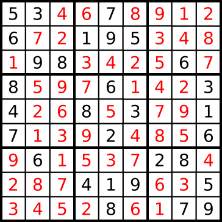

# Recursion and Folding Lab: Sudoku Solver

## Part 0: Background and Setup

###(0a): Background

[Sudoku](https://en.wikipedia.org/wiki/Sudoku) is a

> combinatorial number-placement puzzle. The objective is to fill a 9×9 grid with digits so that each column, each row, and each of the nine 3×3 sub-grids that compose the grid ("tiles") contains all of the digits from 1 to 9.

Puzzle; initial conditions


A solution



In this lab we will implement a Sudoku solver that can find one or more solutions for a puzzle.  We refer to the incomplete puzzle as the "initial conditions."

An ill-posed puzzle will have no solution.

###(0b): Environment setup

Open object `Sudoku` in your editor, located in file `scala-class/misc/src/main/scala/com/datascience/education/misc/sudoku/Sudoku.scala`.

In the terminal, start SBT in the `scala-class` directory:

```
bash-3.2$ pwd
../scala-class
bash-3.2$ sbt
Java HotSpot(TM) 64-Bit Server VM warning: ignoring option MaxPermSize=384m; support was removed in 8.0
[info] Loading project definition from ../scala-class/project
[info] Set current project to scala-class (in build file:../scala-class/)
> 
```

Enter sub-project `misc`:

```
> project misc
[info] Set current project to misc (in build file:/Users/.../scala-class/)
> 
```

Run `SudokuPreview`: 

```
> run
run
[info]  Compiling 1 Scala source to /Users/.../scala-class/common/target/scala-2.11/classes...
...
[warn] Multiple main classes detected.  Run 'show discoveredMainClasses' to see the list

Multiple main classes detected, select one to run:

 [1] com.datascience.education.misc.sudoku.SudokuPreview
 [2] com.datascience.education.misc.sudoku.SudokuSolve
 
Enter number: 1
1

[info] Running com.datascience.education.misc.sudoku.SudokuPreview 
find solutions for this Sudoku board:
5 3 0 0 7 0 0 0 0
6 0 0 1 9 5 0 0 0
0 9 8 0 0 0 0 6 0
8 0 0 0 6 0 0 0 3
4 0 0 8 0 3 0 0 1
7 0 0 0 2 0 0 0 6
0 6 0 0 0 0 2 8 0
0 0 0 4 1 9 0 0 5
0 0 0 0 8 0 0 7 9
rows
0 0 0 0 0 0 0 0 0
1 1 1 1 1 1 1 1 1
2 2 2 2 2 2 2 2 2
3 3 3 3 3 3 3 3 3
4 4 4 4 4 4 4 4 4
5 5 5 5 5 5 5 5 5
6 6 6 6 6 6 6 6 6
7 7 7 7 7 7 7 7 7
8 8 8 8 8 8 8 8 8
columns
0 1 2 3 4 5 6 7 8
0 1 2 3 4 5 6 7 8
0 1 2 3 4 5 6 7 8
0 1 2 3 4 5 6 7 8
0 1 2 3 4 5 6 7 8
0 1 2 3 4 5 6 7 8
0 1 2 3 4 5 6 7 8
0 1 2 3 4 5 6 7 8
0 1 2 3 4 5 6 7 8
tiles
0 0 0 1 1 1 2 2 2
0 0 0 1 1 1 2 2 2
0 0 0 1 1 1 2 2 2
3 3 3 4 4 4 5 5 5
3 3 3 4 4 4 5 5 5
3 3 3 4 4 4 5 5 5
6 6 6 7 7 7 8 8 8
6 6 6 7 7 7 8 8 8
6 6 6 7 7 7 8 8 8
[success] Total time: 82 s, completed Oct 12, 2016 8:02:07 AM
> 


```

###(0c): Semantics

We store our Sudoku board in a `List` of (position, value) tuples. Positions are in [row-major format](https://en.wikipedia.org/wiki/Row-major_order).

```
  val initial = List((0,5),(1,3),(4,7),(9,6),(12,1),(13,9),(14,5),...
```

Each element of the list corresponds to an element in the Sudoku board.

This board has been "flattened" into a row-major list.  The first element of each tuple is the "flattened" coordinate in the Sudoku board (explained momentarily), and the second element of each tuple is the value itself.
   
First, let's establish syntax for elements of the board

Given element M_ij,
i is the row and j is the column.
   
Our row and column indices are 0-indexed, in contrast to the 1-indexed convention of a mathematical matrix.

A Sudoku board is 9 by 9 elements.

* (0, 5) is placed at M_00
* (1, 3) is placed at M_01
* (4, 7) is placed at M_04
* (12, 1) is placed at M_13

Here is partial plot of these four elements, with absent elements of the board filled by 0

```
5 3 0 0 7 0 0 0 0
0 0 0 1 0 0 0 0 0
0 0 0 0 0 0 0 0 0
0 0 0 0 0 0 0 0 0
0 0 0 0 0 0 0 0 0
0 0 0 0 0 0 0 0 0
0 0 0 0 0 0 0 0 0
0 0 0 0 0 0 0 0 0
0 0 0 0 0 0 0 0 0
```

You can print all of `initial` by running `SudokuPreview`


## Part 1: Find solutions to a puzzle

###(1a): Implement `checkY` 

In a valid Sudoku board, each row contains only one copy of each digit 1-9.  In other words, the 9 elements of each row correspond one-to-one with the 9 digits in [1,9].  `checkX` verifies this.

Furthermore, each column contains only one copy of each digit 1-9.

`checkY` is like `checkX`, but for columns.

Let's review the signature of `foldLeft` on `board`.

```
board: List[(Int,Int)]
	
board.foldLeft[B](z: B)(f: (B, (Int, Int)) => B)
```

`foldLeft` will combine every `(Int, Int)` in `board` into a single value of generic type `B`.  

For example, here is a usage of `foldLeft` that counts the elements of the board.

```
val elementCount: Int = board.foldLeft(0)((count: Int, element: (Int, Int)) => count+1)
```
Since `element` is unused, we can replace it with a "don't care" placeholder.  See [What are all the uses of an underscore in Scala?](http://stackoverflow.com/questions/8000903/what-are-all-the-uses-of-an-underscore-in-scala)

```
val elementCount: Int = board.foldLeft(0)((count: Int, _: (Int, Int)) => count+1)
```


As used by `checkX`, type `B` will be `Boolean`.


```
  def checkX(board: List[(Int,Int)], next: (Int,Int)): Boolean = {
    def check(b: Boolean, tuple: (Int,Int)): Boolean = {
      b && ((row(tuple) == row(next) && tuple._2 != next._2) || row(tuple) != row(next))

    }
    board.foldLeft(true)(check)
  }
```

This pseudocode gives an intuitive notion of what `foldLeft` is being used for:

```
  def checkX(board: List[(Int,Int)], next: (Int,Int)): Boolean = {
    def check(b: Boolean, tuple: (Int,Int)): Boolean = {
      some predicate on tuple: (Int, Int) and b: Boolean 

    }
    board.foldLeft(true)(check)
  }
```

For `checkX` to return `true`, `next._2` must not equal any value on the board of the same row.

For `checkY` to return `true`, `next._2` must not equal any value on the board of the same column.

#### Task

Complete the implementation of `checkY`.

```
def checkY(board: List[(Int,Int)], next: (Int,Int)): Boolean =
```

Just as `checkX` utilizes the method `row`, `checkY` should utilize the method `column`.


### Task (1b): Implement `checkT`

The same rules that apply to rows and columns apply to the 9 tiles of the Sudoku board.

`checkT` is like `checkX` and `checkY`, but for tiles.

For `checkX` to return `true`, `next._2` must not equal any value on the board of the same row.

For `checkY` to return `true`, `next._2` must not equal any value on the board of the same column.

For `checkT` to return `true`, `next._2` must not equal any value on the board of the same tile.

Utilize the method `tile`, similar to method `row` or `column`.

### Task (1c): Implement `notPlayed`

Each tuple in `board` consists of an index and a value.

Check that `index` is absent from `board`.  This means that the board is 0, or not played, at this index.

```
def notPlayed(board: List[(Int,Int)], index: Int): Boolean = ???
```

For example, given board

```
val initial = List((0,5),(1,3),(4,7),(9,6),(12,1),(13,9),(14,5))
```

index 2 is not played.  

```
notPlayed(initial, 2) = false
```

### Task (1d): Implement `isLegal`

Tie together `checkX`, `checkY`, and `checkT`.  All three rules must be satisfied for `next`:

```
  def isLegal(board: List[(Int,Int)], next: (Int,Int)): Boolean = ???
```

Hint *relevant to Task (1e)*: We consider a row, column or tile containing an empty index or indices to be *legal*.  

`next = (..., 0)` should never be passed to `isLegal`.  Call `isLegal` inside `sudokuIter`.  Don't check the "legality" of any value outside `[1,9]`.


### Task (1e): Implement `sudokuIter`

The input to `sudokuIter` is a List of empty board indices (board indices holding value 0).

Hint: Handle the case in which the input board has no empty indices.  This board may or may not be a valid Sudoku board, but regardless, there is no solving to be done in this case.

```
  //recursively provide all solutions to puzzle w/ given initial conds
  def sudokuSolve(initial: List[(Int,Int)]): Set[List[(Int,Int)]] = {

    // indices of empty board elements, given initial conditions (pre-filled board)
    val indices: List[Int] =
      (0 until 81) filter { index => notPlayed(initial, index)} toList

    /*
     TASK 1e
     */
    def sudokuIter(indices: List[Int]): Set[List[(Int,Int)]] = ???
	
    sudokuIter(indices)
  }
```

See [documentation on for-comprehensions](http://docs.scala-lang.org/tutorials/tour/sequence-comprehensions.html)

### Task (1f): Run the Sudoku Solver


```
> run 
run 
[warn] Multiple main classes detected.  Run 'show discoveredMainClasses' to see the list
Multiple main classes detected, select one to run:
 [1] com.datascience.education.misc.sudoku.SudokuPreview
 [2] com.datascience.education.misc.sudoku.SudokuSolver
 
Enter number: 2
2
[info] Running com.datascience.education.misc.sudoku.SudokuSolver 
find solutions for this Sudoku board:
5 3 0 0 7 0 0 0 0
6 0 0 1 9 5 0 0 0
0 9 8 0 0 0 0 6 0
8 0 0 0 6 0 0 0 3
4 0 0 8 0 3 0 0 1
7 0 0 0 2 0 0 0 6
0 6 0 0 0 0 2 8 0
0 0 0 4 1 9 0 0 5
0 0 0 0 8 0 0 7 9
solution 
 5 3 4 6 7 8 9 1 2
6 7 2 1 9 5 3 4 8
1 9 8 3 4 2 5 6 7
8 5 9 7 6 1 4 2 3
4 2 6 8 5 3 7 9 1
7 1 3 9 2 4 8 5 6
9 6 1 5 3 7 2 8 4
2 8 7 4 1 9 6 3 5
3 4 5 2 8 6 1 7 9
[success] Total time: 9 s, completed Oct 12, 2016 2:53:17 PM
> 


```

#### Copy your solutions to the second board, `initial2`.  There are many solutions!


