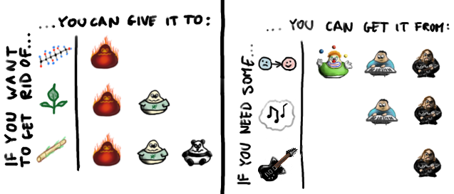
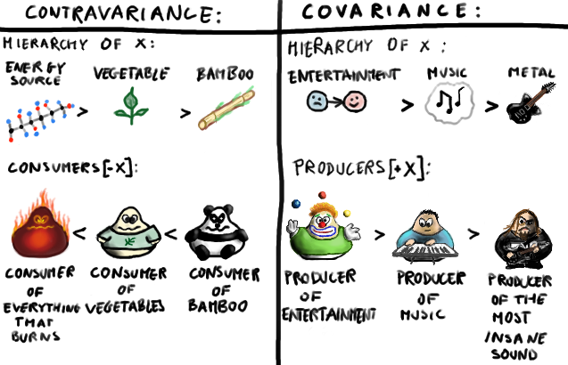

#Lecture 1: Polymorphism

---

#Parametric Polymorphism

Parametric polymorphism is a pattern in which polymorphic functions are written without mention of any specific type, and can thus apply a single abstract implementation to any number of types in a transparent way.

---

Monomorphic methods can only be applied to arguments of the fixed types specified in their signatures (and their subtypes, we’ll see in a moment).
 
 
Polymorphic methods can be applied to arguments of any types which correspond to acceptable choices for their type parameters.

---

    !scala
    def monomorphic(s: String): Int = s.length
    monomorphic("foo")
    //res0: Int = 3
    def polymorphic[T](l: List[T]): Int = l.length
    polymorphic(List(1, 2, 3))
    //res1: Int = 3
    polymorphic(List("foo", "bar", "baz"))
    //res2: Int = 3

---

We can mix in parametric polymorphism at the trait level, as well as add upper and lower type bounds:

    !scala
    trait Plus[A] { def plus(a2: A): A }
    def plus[A <: Plus[A]](a1: A, a2: A): A = a1.plus(a2)

---

However this is not flexible since trait `Plus` needs to be mixed in at the time of defining the datatype, so it can’t work for `Int` and `String` for example.
 
 
We will see how to extend this w/ type classes.

---

#Subtype Polymorphism

Scala is both an object-oriented and a functional programming language, so it exhibits subtype polymorphism as well as parametric polymorphism.
 
 
The methods that we’ve been calling monomorphic are only monomorphic in the sense of parametric polymorphism, and they can in fact be polymorphic in the traditional object-oriented way.

---

For example:

    !scala
    trait Base { def foo: Int }
    class Derived1 extends Base { def foo = 1 }
    class Derived2 extends Base { def foo = 2 }
    def subtypePolymorphic(b: Base) = b.foo
    subtypePolymorphic(new Derived1)
    //res3: Int = 1
    subtypePolymorphic(new Derived2)
    //res4: Int = 2

---

Here the method `subtypePolymorphic` has no type parameters, so it’s parametrically monomorphic.
 
 
Nevertheless, it can be applied to values of more than one type as long as those types stand in a subtype relationship to the fixed `Base` type which is specified in the method signature.

In other words, this method is both parametrically monomorphic and subtype polymorphic.

---

#Variance

In Scala, parametric and subtype polymorphism are unified by the concept of variance.
 
 
Variance refers to a categorical framework undergirding the type system (entirely separate from and in addition to the one commonly used in Haskell).

---

---

[source](https://www.clear.rice.edu/comp310/JavaResources/generics/co_contra_host_visitor.html)

---

A type can be covariant when it does not call methods on the type that it is generic over. If the type needs to call methods on generic objects that are passed into it , it cannot be covariant.
 
 
A type can be contravariant when it does call methods on the type that it is generic over. If the type needs to return values of the type it is generic over, it cannot be contravariant.

---

Strongly typed functional languages like Scala and Haskell have function types.
 
 
For example: "a function expecting a Cat and returning an Animal" (written `Cat => Animal` or `Function1[Cat, Animal]` in Scala syntax).

---

The canonical example is the simple function of a single parameter:

    !scala
    trait Function1[-T1,+R] {
      def apply(v1: T1): R
    }

---

Being an OO language, Scala has sub-typing as well, so you elect to specify when one function type is a subtype of another.
 
 

In particular, `Cat <: Animal` implies:

* `Function1[Animal, Double] <: Function1[Cat, Double]`
* `Function1[Double, Cat] <: Function1[Double, Animal]`

---

In general it is safe to substitute a function `f` for a function `g` if `f` accepts a more general type of arguments and returns a more specific type than `g`.
 
 
For example, a function of type `Cat=>Cat` can safely be used wherever a `Cat=>Animal` was expected, and likewise a function of type `Animal=>Animal` can be used wherever a `Cat=>Animal` was expected.

---

One can compare this to the [robustness principle of communication](https://en.wikipedia.org/wiki/Robustness_principle):

*"be liberal in what you accept and conservative in what you produce"*.

---

Rest assured that the Scala compiler will complain if you violate these rules:

    !scala
    trait T[+A] { def consumeA(a: A) = ??? }
    // error: covariant type A occurs in contravariant position      
    trait T[-A] { def provideA: A = ??? }
    // error: contravariant type A occurs in covariant position

---

#Exercise

    !scala
    class GrandParent // Parent <: GrandParent
    class Parent extends GrandParent // Child <: Parent
    class Child extends Parent // Child <: Grandparent
    class Covariant[+A]
    class Contravariant[-A]

---

    !scala
    def foo(x: Covariant[Parent]): Covariant[Parent] = x
    def bar(x: Contravariant[Parent]): Contravariant[Parent] = x
    foo(new Covariant[Child])
    //???
    foo(new Covariant[GrandParent])
    //???
    bar(new Contravariant[Child])
    //???
    bar(new Contravariant[GrandParent])

---

#Ad-hoc Polymorphism

Ad-hoc polymorphism refers to when a value is able to adopt any one of several types because it, or a value it uses, has been given a separate definition for each of those types.
 
 
The term ad hoc in this context is not intended to be pejorative; it refers to the fact that this type of polymorphism is not a fundamental feature of the type sytem.

---

For example, the + operator essentially does something entirely different when applied to floating-point values as compared to when applied to integers.
 
 
Most languages support at least some ad-hoc polymorphism, but in some languages (like C) it is restricted to only built-in functions and types.

---

Other languages (like C++) allow programmers to provide their own overloading, supplying multiple definitions of a single function, to be disambiguated by the types of the arguments.
 
 
Ad-hoc polymorphism in Scala (with a large debt to Haskell) is most closely associated with what is known as the type class pattern.

---

Type classes define a set of contracts that the client type needs to implement.
 
 
Type classes are commonly misinterpreted as being synonymous with interfaces in Java or other programming languages.

---

The focus with interfaces is on subtype polymorphism.

The focus with type classes changes to type-level parametric polymorphism: you implement the contracts that the type class publishes across unrelated types.
 
 
A second crucial distinction between type classes and interfaces is that for class to be a "member" of an interface it must declare so at the site of its own definition.

---

By contrast, any type can be added to a type class at any time, provided you can provide the required definitions, and so the members of a type class at any given time are dependent on the current scope.
 
 
Type classes are similar to the [GoF adapter pattern](https://en.wikipedia.org/wiki/Adapter_pattern), but are generally cleaner and more extensible.

---

There are three important components to the type class pattern: the type class itself, instances for particular types, and the interface methods that we expose to users.
 
 
The instances of a type class provide implementations for the types we care about, including standard Scala types and types from our domain model.

---

We define instances by creating concrete implementations of the type class and tagging them with the `implicit` keyword:

    !scala
    trait Plus[A] {
      def plus(a1: A, a2: A): A
    }
    implicit object IntPlus extends Plus[Int] {
      def plus(a1: Int, a2: Int): Int = a1 + a2
    }

---

Instances are then exposed to users through interface methods:

    !scala
    def plus(a1: A, a2: A)
      (implicit p: Plus[A]): A = p.plus(a1, a2)
    plus(3,2)
    //res0: Int = 5

---

Note that one place where Haskell is much less verbose than Scala in the above implementation is the instance definition of the type class.
 
 
But here the added verbosity in Scala is not without a purpose and offers a definite advantage over the corresponding Haskell definition.
 
 
In Scala's case we name the instance explicitly as `IntPlus`, while the instance is unnamed in case of Haskell.

---

The Haskell compiler looks into the dictionary on the global namespace for a qualifying instance to be picked up.
 
 
In Scala's case the search is performed locally in the scope of the method call that triggered it.

---

And because the instance is explicitly named in Scala, you can inject another instance into the scope and it will be picked up for use for the implicit.
 
 
So, for example, you could easily define, in different scopes, two or more different implementations of the same type class for the same type.

---

So the type class pattern is truly ad-hoc in the sense that:

* we can provide separate implementations for different types
* we can provide implementations for types without write access to their source code
* the implementations can be enabled or disabled in different scopes

---

#Example: Thrush Combinator

In his classic book [To Mock a Mockingbird](http://www.amazon.com/Mock-Mockingbird-Other-Logic-Puzzles/dp/0192801422), Raymond Smullyan teaches combinatory logic using the analogy of songbirds in a forest.

For example, the Thrush combinator is defined by the following condition:

    T x y = y x

---

The following code is correct but difficult to read:

    !scala
    ((x: Int) => (x * x))(
      (1 to 100).filter(_ % 2 != 0).foldLeft(0)(_+_))

---

Let's fix that with a Thrush combinator. First we define the type class:

    !scala
    case class Thrush[A](x: A) {
      def into[B](g: A => B): B = g(x)
    }
    val x = (1 to 100).filter(_ % 2 != 0)
                      .foldLeft(0)(_ + _)
    Thrush(x).into((x: Int) => x * x)
    //res0: Int = 6250000

---

Now we can provide an implicit instance of the type class for `Int` and use it to re-order our chain of method calls:

    !scala
    implicit def int2Thrush(x: Int) = Thrush[Int](x)
    (1 to 100)
      .filter(_ % 2 != 0)
      .foldLeft(0)(_ + _)
      .into((x: Int) => x * x)

---

#Homework

Read Chapter 10 and get started on Chapter 11 in _Functional Programming in Scala_.
