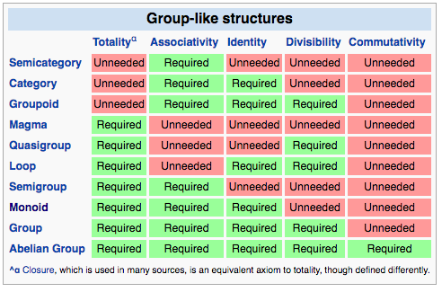

#Lecture 10a: [Algebird](https://github.com/twitter/algebird) in Spark

---
# [Algebird](https://github.com/twitter/algebird)

"Abstract algebra for Scala. This code is targeted at building aggregation systems (via Scalding or Storm)."

 
 

* Algebraic structures like semigroup and monoid, as Scala `trait`s
* Many useful monoids, to fit common aggregation patterns
* However, dependent in production on:
    * Spark
	* [Scalding](https://github.com/twitter/scalding) (batch jobs)
	* [Storm](https://en.wikipedia.org/wiki/Storm_(event_processor)) (streaming)
	* or [Summingbird](https://github.com/twitter/summingbird) ( batch or real time )

---

Associativity allows some parallelism.

We want aggregation `a + b + c + d`

	a + b + c + d ==
	a + (b + (c + d)) ==
	(a + b) + (c + d)

This "splitting" pattern of parallelism is exemplified by exercise 10.7: `foldMapV`

 
 
 
 

Later, commutativity

---
# Count-Min Sketch

"the Sketch ... uses
summary based techniques for delivering approximation queries, gets around the typical problems that
sampling techniques have and are highly parallelizable in practice."

- [Count-Min Sketch - A Data Structure for Stream Mining Applications](http://debasishg.blogspot.com/2014/01/count-min-sketch-data-structure-for.html)

 
 
[Wiki](https://en.wikipedia.org/wiki/Count%E2%80%93min_sketch)

---

Count-Min Sketches can be combined

	!scala
	class CMS[K] {
	  ...
	  // Returns a new sketch that is the combination
	  // of this sketch and the other sketch.
      def ++(other: CMS[K]): CMS[K]
      ...
	}

 
 
 
 

[CMS](http://twitter.github.io/algebird/index.html#com.twitter.algebird.CMS)

---

#[Count-min Sketch Monoid](http://twitter.github.io/algebird/#com.twitter.algebird.CMSMonoid)

	!scala
	class CMSMonoid[K] extends Monoid[CMS[K]]

[Count-Min Sketches](http://twitter.github.io/algebird/#com.twitter.algebird.CMS) under combination form a Monoid.  The identity element is an empty sketch.  It has a generic for the type being counted.

	!scala
	val cmsMonoid: CMSMonoid[Int] = {
      val eps = 0.001
      val delta = 1E-10
      val seed = 1
      CMS.monoid[Int](eps, delta, seed)
    }

---

	!scala
	// def create(item: K): CMS[K]
	// Creates a sketch out of a single item.
	val sketch1: CMS[Int] = cmsMonoid.create(4)
	val sketch2: CMS[Int] = cmsMonoid.create(4)
	val sketch3: CMS[Int] = cmsMonoid.create(6)

	val aggregatedSketch: CMS[Int] =
	  sketch1 ++ sketch2 ++ sketch3

 
 
 

in `slideCode.lecture10a.CountMinSketchUsage`
and `slideCode.lecture10a.SketchExample`

---

	frequency of 4 in sketch1 =
	  Approximate(1,1,1,1.0)
	frequency of 6 in sketch1 =
	  Approximate(0,0,0,1.0)

	frequency of 4 in aggregatedSketch =
	  Approximate(2,2,2,0.9999999999)
	frequency of 6 in aggregatedSketch =
	  Approximate(1,1,1,0.9999999999)

 
 
 
 
 
 

in `slideCode.lecture10a.SketchExample`

---

# Algebird example

Counting approximate number of Tweets per user;

an example of a Key-Value aggregation

	!scala
	case class Tweet(userId: Int, message: String,
	                 time: DateTime)

	def generateTweets(n: Int): Seq[Tweet] = ...

 
 
 
 

in `slideCode.lecture10a.Tweets`

---

	!scala
	val tweets: Seq[Tweet] = generateTweets(32)

	val userIds: Seq[Int] =
	  tweets.map { tweet => tweet.userId }

	// cmsMonoid.create(data: Seq[K]): CMS[K]`
	// Creates a sketch out of multiple items.
	val sketch: CMS[Int] = cmsMonoid.create(userIds)

This version of `create` folds with the Monoid.  It hides a lot under the hood.

It useful for one-off experimentation, but not production use of the CMSMonoid.

 
 
 

in `slideCode.lecture10a.CountMinSketchUsage` and `slideCode.lecture10a.CountMinSketchUsageExample`

---
Values in the Sketch

	Count Min Sketch counts
	user 0 Approximate(1,1,1,0.9999999999)
	user 1 Approximate(3,3,3,0.9999999999)
	user 2 Approximate(1,1,1,0.9999999999)
	user 3 Approximate(2,2,2,0.9999999999)
	user 4 Approximate(0,0,0,1.0)
	user 5 Approximate(1,1,1,0.9999999999)
	...

---

	exact counts
	user 0 exact count Some(1)
	user 1 exact count Some(3)
	user 2 exact count Some(1)
	user 3 exact count Some(2)
	user 4 exact count None
	user 5 exact count Some(1)

---

Commutativity improves parallelism further and reduces storage requirements.

Reducing storage requirements is the essence of "real-time" streaming analysis.

We want aggregation `a + b + c + d`

Imagine a stream where `c` and `d` arrive first, `b` second and `a` third.

	c + d = e

	(e + b) + a ==
	c + d + b + a

 
 
 
 

[Sources  at 7:40 and 12:45](https://www.parleys.com/tutorial/algebird-algebra-efficient-big-data-processing)

---

[Source: Outline of algebraic structures](https://en.wikipedia.org/wiki/Outline_of_algebraic_structures)

---

There is no data type in Algebird that connotates commutativity.
[Discussion](https://github.com/twitter/algebird/issues/128)

There is only run-time checking

	!scala
	def isCommutativeEq[T: Semigroup]
	  (eqfn: (T, T) => Boolean) =
	  'isCommutativeEq |: forAll { (a: T, b: T) =>
        val semi = implicitly[Semigroup[T]]
        eqfn(semi.plus(a, b), semi.plus(b, a))
      }

Some of this method should look familiar from our monoid laws exercise in lab 10

 
 
 
 
 
 

in `package com.twitter.algebird.BaseProperties`

---
# Max Monoid in Spark

Calculate (exact) maximum score of any game in `basketball_scores.csv`

read CSV

	!scala
	val df: DataFrame = ...

CSV

	...,TeamName,...,ScoreOff,...
	...,Abilene Christian,...,57,...
	...,Abilene Christian,...,100,...
	...,Abilene Christian,...,72,...
	...
	...,Alabama St.,...,73,...
	...

---

Wrap each score in a `Max` object

	!scala
	val maxScores: RDD[Max[Int]] =
	  df.map { (r: Row) => Max(r.getInt(5)) }
	//        5th column; 0-indexed     ^  

Reduce the `Max` objects to a single `Max` object

	!scala
	val maxScore: Max[Int] =
	  maxScores.reduce { (m1, m2) => m1.+(m2) }

in `spark.lecture10a.MaxScoreExample`
 
 

---

	!scala
	(m1, m2) => m1.+(m2)

 
 

[Infix notation for `Max` is buried in Algebird library](http://twitter.github.io/algebird/#com.twitter.algebird.PlusOp).  There is not a clear connection between infix `+` and the `Max` class.  Contrast this with HyperLogLog, later.

---
# [Pair RDD](http://spark.apache.org/docs/latest/api/scala/index.html#org.apache.spark.rdd.PairRDDFunctions)

Calculate max score by team

Want to apply this method:

	!scala
	def reduceByKey(func: (V, V) ⇒ V): RDD[(K, V)]

Key by team name

	!scala
	val keyedScores: RDD[(String, Max[Int])] =
	  keyedRDD.map { (tup: (String, Row)) => {
        val teamName = tup._1
        val row = tup._2
        val score = row.getInt(5)
        (teamName, Max(score))
      }
    }

in `spark.lecture10a.MaxScoreExample`
 

---

	!scala
	val maxScoreByTeam: RDD[(String, Max[Int])] =
	  keyedScores.reduceByKey { (s1, s2) => s1+s2 }

	maxScoreByTeam.foreach {
	  case (teamName: String, maxScore: Max[Int]) =>
	  println(s"Team $teamName  max score $maxScore")}

---

Output

	Team Massachusetts  max score Max(108)
	Team Hampton  max score Max(98)
	Team Winthrop  max score Max(102)
	Team Alabama St.  max score Max(86)
	...

---
# Count-min sketch in Spark

Estimate the number of games each team has played

	!scala
	val df: DataFrame = ...

	val cmsMonoid: CMSMonoid[String] = {
      val eps = 0.001
      val delta = 1E-10
      val seed = 1
      CMS.monoid[String](eps, delta, seed)
    }

 
 

in `spark.lecture10a.CountMinSketchExample`

---

Create [sketch](http://twitter.github.io/algebird/#com.twitter.algebird.CMS) of team name of each row

	!scala
	val teamSketches: RDD[CMS[String]] =
	  df.map { (row: Row) =>
	    cmsMonoid.create(row.getString(1)) }

Reduce sketches to single sketch

	!scala
	val counts: CMS[String] =
	  teamSketches.reduce { (s1, s2) =>
	    cmsMonoid.plus(s1, s2) }

---

Find distinct team names

	!scala
	val teams: RDD[String] =
	  df.map { (row: Row) =>
	    row.getString(1) }.distinct()

Extract *frequency* of each key in aggregate sketch

	!scala
	teams.foreach { teamName =>
      val freqEstimate =
	    counts.frequency(teamName).estimate
      println(s"... $teamName ... $freqEstimate ...")
    }

---

	Team Tennessee Tech played an estimated 28 games
	Team Western Mich. played an estimated 30 games
	Team Savannah St. played an estimated 29 games
	Team Campbell played an estimated 27 games
	Team Memphis played an estimated 34 games
	Team Colorado St. played an estimated 32 games
	Team Bowling Green played an estimated 32 games
	Team Loyola Maryland played an estimated 30 games
	Team Hampton played an estimated 30 games
	Team Massachusetts played an estimated 32 games
	Team Winthrop played an estimated 29 games
	...

---
# HyperLogLog in Spark

Estimate the number of unique rows

	!scala
	val df: DataFrame = ...

	val hll = new HyperLogLogMonoid(12)

---

Hash and sketch each [`Row`](http://spark.apache.org/docs/latest/api/scala/index.html#org.apache.spark.sql.Row)

`r.hashCode` incorporates every value in the row.

	!scala
	val rowHashes: RDD[HLL] =
	  df.map { (r: Row) => hll(r.hashCode) }
 
 

Combine sketches into single sketch

	!scala
	val uniqueRowCount: HLL =
	  rowHashes.reduce( (hll1, hll2) =>
	    hll.plus(hll1, hll2) )

---

	!scala
	println("..."+
             uniqueRowCount.estimatedSize.toLong)
 
 

Output
 
 

	estimated unique rows in data frame: 10813

---

If two rows are identical, they will produce the same hash code.

	row 1: [a,b,123]
	row 2: [a,b,123]
	row 1 hash code: 345508721
	row 2 hash code: 345508721

 
 

in `spark.lecture10a.IdenticalRows`

---

Estimate number of unique teams, taken from `TeamName` column

Hash and make sketch of each team name

	!scala
	val teamSketches: RDD[HLL] =
	  df.map { (r: Row) =>
        hll(r(1).hashCode) }
	//	      ^ TeamName column

---

Reduce sketches to single sketch

	!scala
	val uniqueTeams: HLL =
      teamSketches.reduce( (hll1, hll2) =>
	    hll.plus(hll1, hll2) )

	println("..."+
	        uniqueTeams.estimatedSize.toLong)

Output

	estimate of number of unique teams: 358

---
# Product monoid

Calculate max score *and* estimate games played by team, in one sweep through the data

Use `Max` and `HLL`

	!scala
	val df: DataFrame = ...

	val hll = new HyperLogLogMonoid(12)

key by team name

	!scala
	val keyedRDD: RDD[(String, Row)] =
	  df.rdd.keyBy { (r: Row) => r.getString(1) }

 

in `spark.lecture10a.MaxScoreAndGamesPlayed`

---
Our [product monoid](http://twitter.github.io/algebird/#com.twitter.algebird.Product2Monoid)

	!scala
	val productMonoid: Monoid[(Max[Int], HLL)] =
      new Product2Monoid(
	    (mi: Max[Int], h: HLL) => (mi, h),
        (t: (Max[Int],HLL)) => Some(t))
	    (Max.intMonoid, hll)

 
 
 
in `spark.lecture10a.MaxScoreAndGamesPlayed`

---

	!scala
	val scoresAndCounts:RDD[(String,(Max[Int], HLL))]=
	  keyedRDD.map{ case (teamName: String,row: Row)=>
        val score = row.getInt(5)
        val maxScore: Max[Int] = Max(score)
        val rowSketch: HLL = hll(row.hashCode())
        (teamName, (maxScore, rowSketch))
      }

---

Reduce the products `(Max[Int], HLL)` into a single product, per key

	!scala
	val scoreAndCount:RDD[(String,(Max[Int],HLL))] =
      scoresAndCounts.reduceByKey {
	    (tup1:(Max[Int],HLL), tup2:(Max[Int],HLL)) =>
        productMonoid.plus(tup1, tup2)
      }

---

	!scala
	scoreAndCount.foreach {
	  case (teamName: String, tup: (Max[Int], HLL)) =>
	  println(s"Team $teamName  ... ${tup._1} ...
	            ... ${tup._2.estimatedSize.toLong}")}

Output

	Team Tennessee Tech  max score Max(101)
	                     games played 28
	Team Western Mich.  max score Max(94)
	                     games played 30
	Team Campbell  max score Max(101)
	                games played 27
	Team Savannah St.  max score Max(76)
	                    games played 29
	...

---

#Homework

Re-read Chapter 11 of _Functional Programming in Scala_, and have a look at `Comonad` in [*Cats*](https://github.com/typelevel/cats).

---

# Sources

[Learning Algebird Monoids with REPL](https://github.com/twitter/algebird/wiki/Learning-Algebird-Monoids-with-REPL)

[https://www.parleys.com/tutorial/algebird-algebra-efficient-big-data-processing](https://www.parleys.com/tutorial/algebird-algebra-efficient-big-data-processing)

[https://building.coursera.org/blog/2014/10/23/counting-at-scale-with-scalding-and-algebird/](https://building.coursera.org/blog/2014/10/23/counting-at-scale-with-scalding-and-algebird/)

[http://cdn.oreillystatic.com/en/assets/1/event/105/Algebra%20for%20Scalable%20Analytics%20Presentation.pdf](http://cdn.oreillystatic.com/en/assets/1/event/105/Algebra%20for%20Scalable%20Analytics%20Presentation.pdf)

[https://cs.uwaterloo.ca/~jimmylin/publications/Boykin_etal_VLDB2014_slides.pdf](https://cs.uwaterloo.ca/~jimmylin/publications/Boykin_etal_VLDB2014_slides.pdf)

[What is Twitter's interest in abstract algebra (with algebird)?](https://www.quora.com/What-is-Twitters-interest-in-abstract-algebra-with-algebird)

[HyperLogLog tutorial](https://github.com/twitter/algebird/wiki/HyperLogLog)

[http://cem3394.github.io/scala-monoids/#slide1](http://cem3394.github.io/scala-monoids/#slide1)

---
