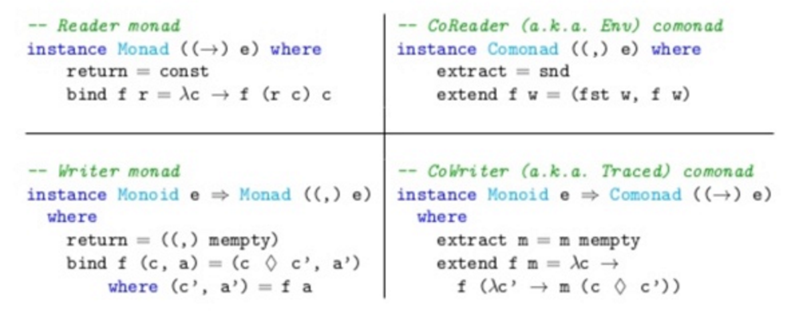

#Lecture 11: Comonads

---

Comonads are the [categorical dual](https://en.wikipedia.org/wiki/Dual_(category_theory)) of monads.

Whenever you see a data structure or operation pieced together out of a number of similar, 'local' operations, you may have a comonad.

---

Recall that a monad is a functor `M` equipped with two additional polymorphic functions, one from `A` to `M[A]` and one from `M[M[A]]` to `M[A]`.

    !scala
    trait Monad[M[_]] extends Functor[M] {
      def unit[A](a: A): M[A]
      def join[A](mma: M[M[A]]): M[A]
    }

Recall also that `join` has to satisfy associativity, and `unit` has to be an identity for `join`.

---

In Scala a monad is often stated in terms of `flatMap`, which is map followed by `join`.

The above formulation is closer to the mathematical definition of a monad however, and is easier to translate to comonads.

---

A comonad is the same thing as a monad, only backwards:

    !scala
    trait Comonad[W[_]] extends Functor[W] {
      def counit[A](w: W[A]): A
      def duplicate[A](wa: W[A]): W[W[A]]
    }

---

`counit` (sometimes called `extract`) allows you to get a value of type `A` out of a `W[A]`. While with monads you can generally only put values in and not get them out, with comonads you can generally only get them out and not put them in.

And instead of being able to `join` two levels of a monad into one, we can `duplicate` one level of a comonad into two.

---

Intuitively, a monad adds structure by consuming values, whereas a comonad adds values by consuming structure.

A monad defines a class of programs whose subexpressions are incrementally generated from the outputs of previous expressions, whereas a comonad defines a class of programs that incrementally generate output from the substructure of previous expressions.

---

#comonad laws

First, let's recall the familiar monad laws:

1. Left identity: `join(pure(x)) == x`
2. Right identity: `x.flatMap(pure) == x`
3. Associativity: `join(join(x)) == join(map(x)(join))`

bind ( return f) == f
bind ( return _) == id
(bind f)(bind g) == bind (f (bind g)
---

extract (extend f) == f
extend (extract _) == id
(extend f)(extend g) == extend (f (extend g))

Now compare these to the comonad laws:

1. Left identity: `extract(duplicate(x)) == x`
2. Right identity: `x.extend(extract) == x`
3. Associativity: `x.duplicate.duplicate == x.duplicate.map(duplicate)`

---

It can be hard to get an intuition for what these laws mean, but in short they mean that (co)Kleisli composition in a comonad should be associative and that `extract` (a.k.a. `counit`) should be an identity for it.

Very informally, both the monad and comonad laws mean that we should be able to compose our programs top-down or bottom-up, or any combination thereof, and have that mean the same thing regardless.

---

#Identity

A simple and obvious comonad is the `Id` comonad:

    !scala
    case class Id[A](a: A) {
      def map[B](f: A => B): Id[B] = Id(f(a))
      def counit: A = a
      def duplicate: Id[Id[A]] = Id(this)
    }

---

`Id` doesn’t have any functionality other than the proper morphisms of the (co)monad and is therefore not terribly interesting.

We can get the value out with our `counit`, and we can vacuously duplicate by decorating our existing `Id` with another layer.

---

#Nonempty structures

Since a comonad has to have a `counit`, it must be “pointed” or nonempty in some sense.

That is, given a value of type `W[A]` for some comonad W, we must be able to get a value of type `A` out.

The identity comonad is a simple example of this. We can always get a value of type `A` out of `Id[A]`.

---

A slightly more interesting example is that of non-empty lists:

    !scala
    case class NEL[A](head: A, tail: Option[NEL[A]])

---

So a nonempty list is a value of type `A` together with either another list or `None` to mark that the list has terminated.

Unlike the traditional `List` data structure, we can always safely get the head.

But what is the comonadic `duplicate` operation here?

---

`duplicate` should allow us to go from `NEL[A]` to `NEL[NEL[A]]` in such a way that the comonad laws hold. Here is a toy implementation:

    !scala
    case class NEL[A](head: A, tail: Option[NEL[A]]) {
      ...
      def duplicate: NEL[NEL[A]] =
        NEL(this, tail.map(_.duplicate))
      ...
    }

---

The duplicate operation returns a list of all the suffixes of the given list.

This list of lists is always nonempty, because the first suffix is the list itself.

For example, if we have the nonempty list `[1,2,3]`, the duplicate of that will be `[[1,2,3], [2,3], [3]]`.

---

To get an idea of what this means in the context of a comonadic program, think of this in terms of `coKleisli` composition (i.e. Kleisli composition in a comonad), using `extend`:

    !scala
    def extend[A,B](f: NEL[A] => B): NEL[B] =
      duplicate map f

---

When we `map` over `duplicate`, the function `f` is going to receive each suffix of the list in turn.

This means that `extend` has access to a particular element and the whole tail of the list from that element onwards (i.e. it has access to the element and a _context_).

---

For a `NEL`, `extend` applies `f` to each of those suffixes and collect the results in a (nonempty) list. So `[1,2,3].extend(f)` will be `[f([1,2,3]), f([2,3]), f([3])]`.

The name `extend` refers to the fact that it takes a “local” computation (here a computation that operates on a list) and extends that to a “global” computation that operates on all substructures of the larger structure (here over all suffixes of the list).

---

#Reader and Coreader (a.k.a. Env)

The `Reader` monad encodes scope and function composition along with the ability to ask for a value:

    !scala
    case class Reader[R,A](run: R => A)
    def ask[R]: Reader[R,R] = Reader(r => r)

---

The meaning of `join` in the reader monad is to pass the same context of type `R` to both the outer scope and the inner scope:

    !scala
    def join[R,A](r: Reader[R,Reader[R,A]]) =
      Reader((c:R) => r.run(c).run(c))

---

Here is a toy implementation of `Coreader`:

    !scala
    case class Coreader[R,A](extract: A, ask: R) {
      def map[B](f: A => B): Coreader[R,B] =
        Coreader(f(extract), ask)
      def duplicate: Coreader[R, Coreader[R, A]] =
        Coreader(this, ask)
    }

---

But in `Coreader`, we don’t have to pretend to have an `R` value. It’s just right there and we can look at it.

So `Coreader` just wraps up some value of type `A` together with some additional context of type `R`.

We could also think of `Coreader` as a sort of two-element `NEL`.

---

Similarly to `NEL`, `Coreader`s `duplicate` embeds the entire `Coreader` in the `extract` field.

Any subsequent `extract` or `map` operation will be able to observe both the value of type `A` and the context of type `R`.

We can think of this as passing the context along to those subsequent operations, which is analogous to what the reader monad does.

---

Just as `map` followed by `join` is usually expressed as `flatMap`, `duplicate` followed by `map` is usually expressed as a single operation:

    !scala
    case class Coreader[R,A](extract: A, ask: R) {
      ...
      //coFlatMap
      def extend[B](f: Coreader[R,A] => B): Coreader[R,B] =
        duplicate map f
    }

---

Notice that the type signature of extend looks like `flatMap` with the direction of `f` reversed.

And just like we can chain operations in a monad using `flatMap`, we can chain operations in a comonad using `extend`.

In `Coreader`, `extend` is making sure that `f` can use the context of type `R` to produce its `B`.

---

We can give a `comonad` instance for all of this as follows:

    !scala
    def coreaderComonad[R]: comonad[Coreader[R,?]] =
      new Comonad[Coreader[R,?]] {
        def map[A,B](c: Coreader[R,A])(f: A => B) = c map f
        def counit[A](c: Coreader[R,A]) = c.extract
        def duplicate(c: Coreader[R,A]) = c.duplicate
        def extend[A,B](f: Coreader[R,A] => B) =
          duplicate map f
      }

---

#Writer and Cowriter (a.k.a. Traced)

The `Writer` monad has the ability to write a value on the side:

    !scala
    case class Writer[W: Monoid, A](value: A, log: W)
    def tell[W,A](w: W): Writer[W, Unit] = Writer((), w)

---

The meaning of `join` in the writer monad is to concatenate the log of written values using the monoid for `W`, and the meaning of unit is to write an empty log:

    !scala
    def join[W: Monoid, A](w: Writer[W, Writer[W, A]]) =
      Writer(w.value.value, Monoid[W].combine(w.log, w.value.log))
    def unit[W: Monoid, A](a: A) = Writer(a, Monoid[W].empty)

---

Just like the writer monad, the writer comonad can append to a log or running tally using a monoid.

However instead of keeping the log always available to be appended to, it uses the same trick as the `Reader` monad by building up an operation that gets executed once a log becomes available.

---

    !scala
    case class Cowriter[W:Monoid,A](tell: W => A) {
      def map[B](f: A => B): Cowriter[W,B] = Cowriter(tell andThen f)
      def extract = tell(Monoid[W].empty)
      def duplicate: Cowriter[W, Cowriter[W, A]] =
        Cowriter(w1 => Cowriter(w2 => tell(Monoid[W].combine(w1, w2))))
      def extend[B](f: Cowriter[W,A] => B): Cowriter[W,B] =
        duplicate map f
    }

---

Note that `duplicate` returns a whole `Cowriter` from its constructed run function, so the meaning is that subsequent operations (composed via `map` or `extend`) have access to exactly one `tell` function, which appends to the existing log or tally.

For example, `foo.extend(_.tell("hi"))` will append `"hi"` to the log of `foo`.

---

It's instructive to compare this with `Reader`.

In the reader monad, the `ask` function is the identity function.

That’s saying “once the `R` value is available, return it to me”, making it available to subsequent `map` and `flatMap` operations.

---

Finally, here is an implementation of `extend` as a primitive combinator:

    !scala
    def extend[B](f: Cowriter[W,A] => B): Cowriter[W,B] =
      Cowriter {
        w1:W => f( Cowriter {
          w2:W => tell(Monoid[W].combine(w1, w2)) } )
      }

---

Let's see how all of this looks in Haskell:

---

#Writer/Reader Duality

If we look at a Kleisli arrow in the `Reader[R,?]` comonad, it looks like `A => Reader[R,B]`, or expanded out: `A => R => B`.

If we uncurry that, we get `(A, R) => B`, and we can go back to the original by currying again.

Notice also that a value of type `(A, R) => B` is a `coKleisli` arrow in the `Coreader` comonad.

Remember that Coreader[R,A] is really a pair (A, R).

---

So the answer to the question of how Reader and Coreader are related is that there is a one-to-one correspondence between a Kleisli arrow in the Reader monad and a coKleisli arrow in the Coreader comonad.

More precisely, the Kleisli category for `Reader[R,?]` is isomorphic to the coKleisli category for `Coreader[R,?]`. The correspondence between them is given by currying and uncurrying.

http://cstheory.stackexchange.com/questions/2101/reader-writer-monads

---

The additional tupled and untupled come from the unfortunate fact that Scala differentiates between functions of two arguments and functions of one argument that happens to be a pair.

So a more succinct description of this relationship is that Coreader is left adjoint to Reader.

Generally the left adjoint functor adds structure, or is some kind of “producer”, while the right adjoint functor removes (or “forgets”) structure, or is some kind of “consumer”.

---

---

The return method injects a pure value into a monadic value (having no effect).

return  :: Monad m     => a -> m a
The dual to monadic return is extract (sometimes called “counit” or “coreturn“), which extracts a value out of a comonadic value (discarding the value’s context). category-extras library splites this method out from comonad into the Copointed class:

extract :: Copointed w => w a -> a
Monadic values are typically produced in effectful computations:

a -> m b
comonadic values are typically consumed in context-sensitive computations:

w a -> b
(Kleisli arrows wrap the producer pattern, while CoKleisli arrows wrap the consumer pattern.)

Monads have a way to extend a monadic producer into one that consumes to an entire monadic value:

(=<<) :: (Monad m) => (a -> m b) -> (m a -> m b)
We more often see this operation in its flipped form (obscuring the conceptual distinction between Haskell arrows and arbitrary category arrows):

(>>=) :: (Monad m) => m a -> (a -> m b) -> m b
Dually, comonads have a way to extend a comonadic consumer into one that produces an entire comonadic value:

extend :: (comonad w) => (w a -> b) -> (w a -> w b)
which also has a flipped version:

(=>>) :: (comonad w) => w a -> (w a -> b) -> w b
Another view on monads is as having a way to join two monadic levels into one.

join      :: (Monad   m) => m (m a) -> m a
Dually, comonads have a way to duplicate one level into two:

duplicate :: (comonad w) => w a -> w (w a)

---

Much more to pursue here: streams, zippers, costate monads (a.k.a `Stores`).

One definition of `Lens`: `Lens(s,a) = a => Store(s,a)`

Hence the statement "Lenses are the coalgebras of the costate comonad"

---

#Homework

Have a look at monad transformers in [*Cats*](https://github.com/typelevel/cats).

---

#Links
[A Scala comonad Tutorial](http://blog.higher-order.com/blog/2015/06/23/a-scala-comonad-tutorial/), Rúnar Bjarnason
