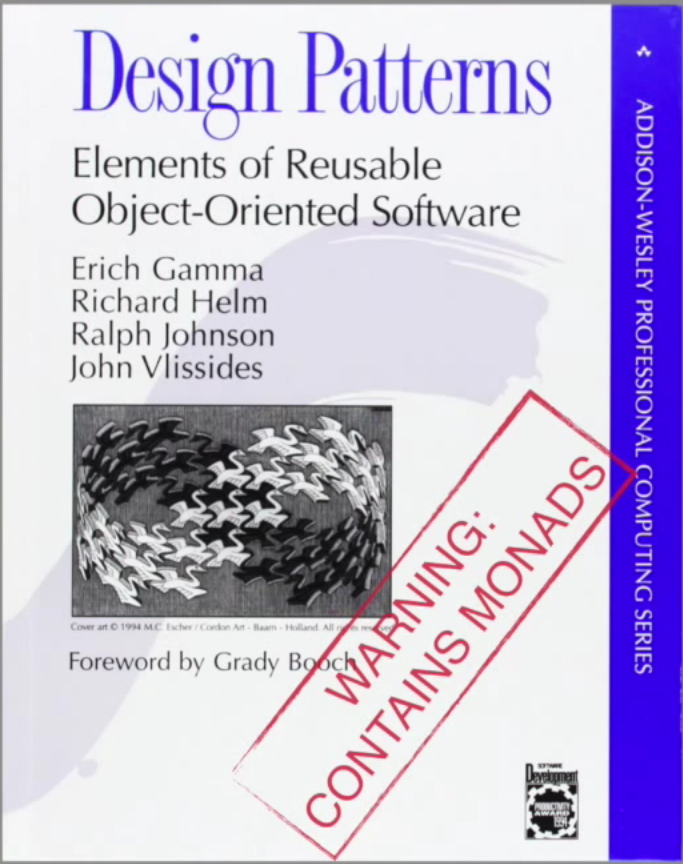

#Lecture 13a: Interpreters

Much of this lecture is drawn from Noel Welsh's excellent article ["Opaque and Transparent Interpreters"](http://underscore.io/blog/posts/2016/06/27/opaque-transparent-interpreters.html).

---

Let's begin with a simple algebraic data type:

		!scala
		sealed trait Interact[A]
		case class Ask(prompt: String) extends Interact[String]
		case class Tell(msg: String) extends Interact[Unit]

---

In the ADT above, each node in the ADT represents verbs or actions that your Application exposes through its API.

Each one of the operations exposes the type of input arguments and what outputs they produce.

In this way, asking the user for a value requires a prompt message `Ask(prompt: String)` and will return a value once the user provides the input extends `Interact[String]`.

---

Once you have the operations defined you can lift them into the context of `Free` with `liftF`, which is what you will ultimately use to write your program.

		!scala
		import cats.free._
		object InteractOps {
		    def ask(prompt: String) : Free[Interact, String] =
		        Free.liftF[Interact, String](Ask(prompt))
		    def tell(msg: String) : Free[Interact, Unit] =
		        Free.liftF[Interact, Unit](Tell(msg))
		}

---

Now that we have smart constructors wrapping our ADT, we can write a program like this:

		!scala
		import InteractOps._
		val program = for {
		    cat <- ask("What's the kitty's name?")
		    _ <- tell(s"You said $cat")
		} yield ()

---

Note that there isn’t an implementation for `Ask` and `Tell` yet. At this point, our program is nothing but a tree-like structure:

		!scala
		Gosub(
		    Suspend(
		        Ask(What's the kitty's name?)),
		        ...)

---

Each time `flatMap` is invoked through the use of for comprehensions, the tree continues to branch and grow by chaining operations that will be performed sequentially down the road once they’ve been evaluated.

However in order to evaluate this `Free` structure, we must provide an interpreter.

---

An interpreter in the context of free monads is a function called a natural transformation.

A natural transformation (usually notated in Scala as `~>`) transforms a functor `F[_]` into another functor `G[_]`.

In this context it transforms the initial ADT based operations into an actual value wrapped by a target runtime monad, such as `Task`, `Future`, `Option` etc.

---

The target monad here is `Id`, which does nothing but wrap a value:

		!scala
		import cats.{Id, ~>}
		def interpreter : Interact ~> Id = new (Interact ~> Id) {
		    def apply[A](fa: Interact[A]) : Id[A] = fa match {
		        case Ask(prompt) => println(prompt); readLine
		        case Tell(msg) => println(msg)
		    }
		}

---

Finally, you can interpret your program like this:

		!scala
		val evaluated = program foldMap interpreter
		//What's the kitty's name? <Waits for user input>
		//You said Tom

---

This might remind you of our free monoid discussion from last time:

		!haskell
		interpretMonoid :: Monoid b => (a -> b) -> ([a] -> b)
		interpretMonoid f [] = mempty
		interpretMonoid f (a : as) = f a <> interpretMonoid f as

---

The interpreter is the über pattern of functional programming.

Most large programs written in a functional style can be viewed as using this pattern.

---

The idea is to treat the interpreter as part of the runtime, and treat programs as values right up until we run them.

This decouples business logic not just from implementation, but also runtime interpretation, allowing us to handle effects and still keep desirable properties such as substitution.

---

One important reason for functional programmers liking the interpreter pattern is how it allows us to deal with effects.

Effects are problematic, because they break substitution. Substitution allows easy reasoning about code, so functional programmers strive hard to maintain it.

At some point you have to have effects—if not, the program will not do anything useful.

The secret to allowing effects is to delay them until some point in the program where we don’t care about substitution anymore.

---

#Example: Doobie

For example, with a jdbc connection we can delay effects till we’ve constructed the query we'd like to use.

		!scala
		import doobie.imports._
		import doobie.util.compat.cats.monad._
		import cats._, cats.data._, cats.implicits._
		val xa = DriverManagerTransactor[IOLite](
		  "org.postgresql.Driver", "jdbc:postgresql:world", "postgres", ""
		)

---

		!scala
		val program =
		  for {
		    a <- sql"select 42".query[Int].unique
		    b <- sql"select random()".query[Double].unique
		  } yield (a, b)
		program.transact(xa).unsafePerformIO
		//res0: (Int, Double) = (42,0.3444089279510081)

---

#Example: Random

The `Random` monad allows us to separate describing how to generate random data from actually introducing randomness.

Randomness is an effect (a function that generates a random value breaks substitution, as it returns a different value each time it is called) and we want to use the `Random` monad to control this effect.

---

Let’s look at two different implementation strategies.

The first strategy is to reify the methods to an algebraic data type.

---

		!scala
		import cats.Monad
		sealed trait ADT[A] extends Product with Serializable {
		  def run(rng: scala.util.Random = scala.util.Random): A =
		    this match {
		      case Prim(sample) => sample(rng)
		      case FlatMap(fa, f) => f(fa.run(rng)).run(rng)
		    }
		  def flatMap[B](f: A => ADT[B]): ADT[B] = FlatMap(this, f)

		  def map[B](f: A => B): ADT[B] =
		    FlatMap(this, (a: A) => ADT.always(f(a)))
		}

---

		!scala
		object ADT {
		  def always[A](a: A): ADT[A] = Prim(rng => a)
		  def int: ADT[Int] = Prim(rng => rng.nextInt())
		  def double: ADT[Double] = Prim(rng => rng.nextDouble())

		  implicit object randomInstance extends Monad[ADT] {
		    def flatMap[A, B](fa: ADT[A])(f: (A) ⇒ ADT[B]): ADT[B] =
		      fa.flatMap(f)
		    def pure[A](x: A): ADT[A] =
		      ADT.always(x)
		  }
		}
		case class FlatMap[A,B](fa: ADT[A], f: A => ADT[B]) extends ADT[B]
		case class Prim[A](sample: scala.util.Random => A) extends ADT[A]

---

An alternative implementation strategy is to reify with functions.

		!scala
		final case class Lambda[A](get: scala.util.Random => A) {
		  def run(rng: scala.util.Random = scala.util.Random): A =
		    get(rng)
		  def flatMap[B](f: A => Lambda[B]): Lambda[B] =
		    Lambda((rng: scala.util.Random) => f(get(rng)).run(rng))
		  def map[B](f: A => B): Lambda[B] =
		    Lambda((rng: scala.util.Random) => f(get(rng)))
		}

---

		!scala
		object Lambda {
		  def always[A](a: A): Lambda[A] = Lambda(rng => a)
		  def int: Lambda[Int] = Lambda(rng => rng.nextInt())
		  def double: Lambda[Double] = Lambda(rng => rng.nextDouble())
		  implicit object randomInstance extends Monad[Lambda] {
		    def flatMap[A, B](fa: Lambda[A])(f: (A) ⇒ Lambda[B]): Lambda[B] =
		      fa.flatMap(f)
		    def pure[A](x: A): Lambda[A] =
		      Lambda.always(x)
		  }
		}

---

In the literature, the former strategy (`ADT`) is called a shallow embedding, because we can programmatically inspect the `ADT` data structure.

The latter strategy (`Lambda`) is called a deep embedding, because we can’t look into the anonymous functions.

There are two ways in which the deep embedding is superior to the shallow embedding.

---

First, the deep embedding doesn’t require us to implement an algebraic data type to represent the “language” we want to interpret.

We can rely on functions, which in some sense are universal interpreters.

We can represent any language we like in terms of functions, so long as we can accept the semantics we get.

---

The second main advantage of the deep embedding is that code within a function is just code.

The compiler is going to have a much easier time optimizing the opaque representation than the transparent one.

We can say the opaque representation is more transparent to the compiler.

---

However, the shallow embedding is more modular than the opaque one.

With a shallow embedding we can see the structure of the program we’re interpreting in terms of its ADT representation.

This means we can choose to interpret it in different ways.

---

For instance, we could print logging information during interpretation, or run in a distributed environment, or use a “stackless” implementation to avoid overflowing the stack in deeply nested calls.

We can also take advantage of the modularity offered by shallow embeddings is by capturing common patterns in reusable classes.

This is exactly what the free monad does.
---

#Example: Random with Cats

Let's look at an implementation using the Cats free monad.

This time we'll add a twist: we'll make the interpreter comonadic.

---

		!scala
		import cats.free.Free
		import cats.{Comonad,Monad}
		type Random[A] = Free[Prim,A]
		final case class Prim[A](sample: scala.util.Random => A)
		implicit val randomMonad: Monad[Random] = Free.freeMonad
		implicit def randomInterpreter(implicit rng: scala.util.Random = scala.util.Random): Comonad[Prim] =
		  new Comonad[Prim] {
		    override def coflatMap[A, B](fa: Prim[A])(f: (Prim[A]) => B): Prim[B] =
		      Prim(rng => f(fa))
		    override def counit[A](fa: Prim[A]): A =
		      fa.sample(rng)
		    override def map[A, B](fa: Prim[A])(f: (A) => B): Prim[B] =
		      Prim(rng => f(fa.sample(rng)))
		  }

---

		!scala
		val a: Prim[Int] = Prim {_.nextInt}
		//a: Prim[Int] = Prim(<function1>)
		val foo = randomInterpreter
		//foo: cats.Comonad[Prim] = $anon$1@5d62ad43
		foo.counit(a)
		//res0: Int = 160270087
		foo.coflatMap(a)(foo.extract(_).toRadians)
		//res1: Prim[Float] = Prim(<function1>)

---

Note that transparency is not a binary choice; even in the transparent implementation above, we have opaque functions passed to flatMap.

The ultimate endpoint of a transparent implementation is implementing all language features—conditionals, binding constructs, and everything else—within the little language we’re defining.

---

#Free and Cofree

Let's consider a type of comonad called a Rose tree.

Rose trees are non-empty trees. A tree of this sort has a value of type A at the tip, and a (possibly empty) list of subtrees underneath:

		!scala
		case class Tree[A](tip: A, sub: List[Tree[A]])

<<<<<<< variant A
One obvious use case is something like a directory structure, where each tip is a directory and the corresponding sub is its subdirectories.
>>>>>>> variant B
======= end

---

The `counit` for a Rose tree is simple: we just get the tip.

Here’s `duplicate` for this structure:

		!scala
		def duplicate: Tree[Tree[A]] = Tree(this, sub.map(_.duplicate))

---

This gives us a tree of trees, but what is the structure of that tree?

It will be a tree of all the subtrees.

The tip will be this tree, and the tip of each proper subtree under it will be the entire subtree at the corresponding point in the original tree.

---

That is, when we say `t.duplicate.map(f)` (or equivalently `t extend f`), our `f` will receive each subtree of `t` in turn and perform some calculation over that entire subtree.

The result of the whole expression `t` extend `f` will be a tree mirroring the structure of `t`, except each node will contain `f` applied to the corresponding subtree of `t`.

---

One use case is something like a directory structure, where each tip is a directory and the corresponding sub is its subdirectories.

We can imagine wanting a detailed space usage summary of a directory structure, with the size of the whole tree at the tip and the size of each subdirectory underneath as tips of the subtrees, and so on.

Then `d extend size` creates the tree of sizes of recursive subdirectories of `d`.

---

More generally, `Free[F,A]` is a type of “leafy tree” that branches according to `F`, with values of type `A` at the leaves.

Dually, `Cofree[F,A]` is a type of “node-valued tree” that branches according to `F` with values of type `A` at the nodes.

---

If `Expr` defines the structure of some expression language, then `Free[Expr,A]` is the type of abstract syntax trees for that language, with free variables of type `A`, and `flatMap` binds expressions to those variables.

Dually, `Cofree[Expr,A]` is the type of a closed expression whose subexpressions are annotated with values of type `A`, and `extend` re-annotates the tree.

For example, if you have a type inferencer infer, then e extend infer will annotate each subexpression of e with its inferred type.

---

This comparison of `Free` and `Cofree` says something about monads and comonads in general:

All monads can model some kind of leafy tree structure, and all comonads can be modeled by some kind of node-valued tree structure.

---

In a monad `M`, if `f: A => M[B]`, then `xs map f` allows us to take the values at the leaves `(a:A)` of a monadic structure `xs` and substitute an entire structure `f(a)` for each value.

A subsequent join then renormalizes the structure, eliminating the “seams” around our newly added substructures. In a comonad W, xs.duplicate denormalizes, or exposes the substructure of xs:W[A] to yield W[W[A]].

---

Then we can map a function f: W[A] => B over that to get a B for each part of the substructure and redecorate the original structure with those values.

See Uustalu and Vene’s excellent paper The Dual of Substitution is Redecoration for more on this connection.

---

A monad defines a class of programs whose subexpressions are incrementally generated from the outputs of previous expressions.

A comonad defines a class of programs that incrementally generate output from the substructure of previous expressions.

A monad adds structure by consuming values. A comonad adds values by consuming structure.

---

#Links

http://underscore.io/blog/posts/2016/06/27/opaque-transparent-interpreters.html
http://underscore.io/blog/posts/2016/04/21/probabilistic-programming.html
http://blog.scalac.io/2016/06/02/overview-of-free-monad-in-cats.html
http://eed3si9n.com/herding-cats/Free-monads.html
http://okmij.org/ftp/Computation/free-monad.html
http://underscore.io/blog/posts/2015/04/14/free-monads-are-simple.html#fnref:continuation-monad

https://www.youtube.com/watch?v=M5MF6M7FHPo
https://www.youtube.com/watch?v=rK53C-xyPWw
https://www.youtube.com/watch?v=M258zVn4m2M

https://github.com/DS12/scala-private/blob/master/code/tutorialAnswers/src/main/scala/tutorialAnswers/quasar/IO3.scala
