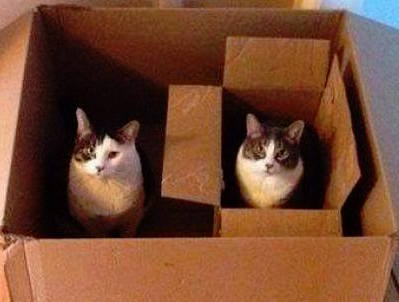

#Lecture 2: Higher-Kinded Types

[Cats](http://typelevel.org/cats/api/#package) and [Boxes](http://adit.io/posts/2013-04-17-functors,_applicatives,_and_monads_in_pictures.html)

---

The bread and butter of everyday functional programming is the implementation of standard functional combinators for your datatypes.
 
 
For example, fluency with the `flatMap` combinator, also known as `>>=`, is very important.

---

The best way to acquire this comfort is to reimplement it a bunch of times, so Functional Programming in Scala has you do just that.

    !scala
    def flatMap[B](f: A => List[B]): List[B]
    def flatMap[B](f: A => Option[B]): Option[B]
    def flatMap[B](f: A => Either[E, B]): Either[E, B]
    def flatMap[B](f: A => State[S, B]): State[S, B]

---

The similarity at the type level is obvious, however there are further connections.
 
 
When you write functions using `flatMap`, in any of the varieties above, these functions inherit a sort of sameness from the underlying `flatMap` combinator.
 
 
Gabriel Gonzalez has referred to this sort of composability as the ['catergory theory design pattern'](http://www.haskellforall.com/2012/08/the-category-design-pattern.html).

---

For example, supposing we have `map` and `flatMap` for a type, we can ‘tuple’ the values within:

    !scala
    def tuple[A, B](x: List[A], y: List[B]):
      List[(A, B)] =
        x.flatMap{a => y.map((a, _))}
    def tuple[A, B](x: Option[A], y: Option[B]):
      Option[(A, B)] =
        x.flatMap{a => y.map((a, _))}
    def tuple[S, A, B](x: State[S, A], y: State[S, B]):
      State[S, (A, B)] =
        x.flatMap{a => y.map((a, _))}

---

Functional Programming in Scala introduces several such functions, such as `sequence` and `traverse`.
 
 
These are each implemented for several types, each time with potentially the same code, if you remember to look back and try copying and pasting a previous solution.

---

We would like to follow the DRY principle and parameterize: extract the parts that are different to arguments, and recycle the common code for all situations.
 
 
In `tuple`’s case, what is different are the `flatMap` and `map` combinator implementations, and the type constructor: `List`, `Option`, `State`, etc.

---

We already have a way to swap out different implementations of the `flatMap` and `map` combinators.
 
 
To generalize the notion of 'tupleability' however, we need to pass type-level functions as arguments.

---
You could think of this as a kind of type-level parametric polymorphism:
 
 

<table class="tg">
 <tr>
   <th class="tg-9hbo">zero-order</th>
   <th class="tg-9hbo">first-order</th>
   <th class="tg-9hbo">second-order</th>
 </tr>
 <tr>
   <td class="tg-9hbo">42</td>
   <td class="tg-yw4l">(x: Int) => x</th>
   <td class="tg-yw4l">(f: (Int => Int)) => f(42)</th>
 </tr>
 <tr>
   <td class="tg-9hbo">Int</td>
   <td class="tg-yw4l">List[_]</th>   
   <td class="tg-yw4l">Monad [M[_]]</th>
 </tr>
</table>

---

The parameter declaration `F[_]` means that `F` may not be a simple type, like `Int` or `String`, but instead a one-argument type constructor, like `List` or `Option`.
 
 
Performing these substitutions for `tupleF`, we get:

    !scala
    def tupleF[F[_], A, B](x: F[A], y: F[B]): F[(A, B)]

---

More complicated and powerful cases are available using partial application.
 
 
That’s how we can fit `State`, `Either`, `Reader`, `Writer` and other type constructors with two or more parameters..

---

The type of `tupleF` expresses precisely our intent—the idea of “multiplying” two `F`s, tupling the values within—but cannot be implemented as written.
 
 
That’s because we don’t have functions that operate on `F`-constructed values, like `x: F[A]` and `y: F[B]`.
 
 
As with any value of an ordinary type parameter, these are opaque.

---

One option is to use subtype polymorphism, we could implement a trait that itself uses a type constructor parameter, then make every type we’d like to support inherit from it:

    !scala
    trait Monadic[F[_], +A] {
      def map[B](f: A => B): F[B]
      def flatMap[B](f: A => F[B]): F[B]
      def tupleF2[F[_], A, B]
        (x: Monadic[F, A], y: Monadic[F, B]):
          F[(A, B)] =
            x.flatMap{a => y.map((a, _))}
    }

---

There are several major problems with the subtyping generalization in `Monadic`.
 
 
These are sufficiently bad to make subtype polymorphism extremely unpopular in the Scala functional community, though you occasionally see it in older code (e.g. [Ermine](https://github.com/ermine-language/ermine-parser/blob/cc77bf6e150a16129744d18d69022f7b5902814f/src/main/scala/scalaparsers/Monadic.scala))

---

First, this pattern can only be applied to classes that we have written ourselves.
 
 
Second, the knowledge required to work out the new type signature above is excessively magical: note how much `tupleF` looked like the `List`-specific type, and how little `tupleF2` looks like either of them.

---

There are also complex rules about when implicit conversion happens, how much duplication of the reference to `Monadic` is required to have the `F` parameter infer correctly, and even how many calls to `Monadic` methods are performed.
 
 
For example, we’d have to declare the `F` parameter as `F[X] <: Monadic[F, X]` if we did one more trailing map call. But then we wouldn’t support implicit conversion cases anymore, so we’d have to do something else, too.

Luckily typeclasses provide an elegant solution to constraining higher-kinded types.

---

For `tupleF`, that means we leave `F` abstract, and leave the argument and the return type unchanged, but add an implicit argument for the typeclass instance:

    !scala
    trait Monad[F[_]] {
      // note the new fa argument
      def map[A, B](fa: F[A])(f: A => B): F[B]
      def flatMap[A, B](fa: F[A])(f: A => F[B]): F[B]
    }

---

We then define instances for the types we’d like to have this on: `Monad[List]`, `Monad[Option]`, etc. Finally, we just add an implicit argument to tupleF:

    !scala
    def tupleF3[F[_], A, B](x: F[A], y: F[B])
               (implicit F: Monad[F]): F[(A, B)] =
      F.flatMap(x){a => F.map(y)((a, _))}

---

Since version 2.8, Scala has provided syntax for implicit parameters, called Context Bounds.
 
 
We can remove the implicit `F` argument, replacing it with a context bound `F[_]: Monad` in the type argument list.

---

#Context Bounds

Briefly, a method with a type parameter `A` that requires an implicit parameter of type `M[A]`, such as

    !scala
    def foo[A](implicit ma: M[A])

 
 

can be rewritten as:

    !scala
    def foo[A: M]

---

If a name is needed, you can still retain the terse method signature with a context bound, and call `implicitly` to materialize the value:

    !scala
    def foo[A: M] = {
       val ma = implicitly[M[A]]
    }

---

#Application: Insertion Sort

    !scala
    def insertionSort[A : Ordering](l: List[A]) =
      l.foldLeft(List[A]()) { (r,c) =>
        val ord = implicitly[Ordering[A]]
        val (front, back) = r.partition(ord.lt(c, _))
        front ::: c :: back
      }
    insertionSort(List(3,2,4,1))
    //res0: List[Int] = List(4, 3, 2, 1)

---

What's the point of passing an implicit parameter in a context bound but _not_ naming it?
 
 
Often, the implicit parameter need not be referred to directly, it will be tunneled through as an implicit argument to another method that is called.

---

This is the case with most higher-kinded types in Cats, for example [here](https://github.com/typelevel/cats/blob/master/core/src/main/scala/cats/syntax/foldable.scala):

    !scala
    trait FoldableSyntax {
      implicit def catsSyntaxNestedFoldable
        [F[_]: Foldable, G[_], A]
        (fga: F[G[A]]): NestedFoldableOps[F, G, A] =
          new NestedFoldableOps[F, G, A](fga)
    }

---

Earlier I mentioned the ['catergory theory design pattern'](http://www.haskellforall.com/2012/08/the-category-design-pattern.html).

[Category theory](https://en.wikipedia.org/wiki/Category_theory) is a branch of mathematics that grew up around algebraic topology in the mid-20th century, but has been increasingly applied to areas of computer science, particularly type theory.

---

We can think of a category as a _generalized monoid_.

Observe that with a monoid `M`, we can view each element of the monoid as a function of type `M => M`. For example, in the `Int` monoid with addition, these elements are `(_ + 0)`, `(_ + 1)`, etc.

Then the composition of these functions is the operation of the monoid.

---

We can generalize this notion to consider not just the type `M`, but all types (`A`, `B`, `C`, etc.) and functions not just of type `M => M`, but `A => B` for any types `A` and `B`.

Then ordinary function composition is an associative operation, with an identity element which is the `identity` function that just returns its argument.

---

#Monads

[Monads](https://en.wikipedia.org/wiki/Monad_(functional_programming)) are one of the most common abstractions in Scala, and one that most Scala programmers are familiar with even if they don’t know the name.
 
 
We even have special syntax in Scala to support monads: for comprehensions.

---

Despite the ubiquity of the concept, Scala lacks a concrete type to encompass monads.
 
 
This is one of the many benefits of using Cats.

---

Formally, a monad for a type `M[A]` has:

* an operation `flatMap` with type `(M[A], A => M[B]) => M[B]`
* an operation `pure` with type `A => M[A]`.
 
 

---

`pure` (often referred to as `unit` or `return`) abstracts over the constructor of our monad.
 
 
`flatMap` (often referred to as `bind` and given the infix notation `>>=`) chains structured computations together in a way that allows interference between the structure and computation layers.

---

In Haskell, the monad typeclass is written as follows:

    !haskell
    class Applicative m => Monad m where
        (>>=)       :: m a -> (a -> m b) -> m b
        return      :: a -> m a
        return      = pure

---

Most of the type classes we consider in this class are monadic: `List`, `Vector`, `Option`, `Xor`, `State`, `Future`, `Parser`, `Reader`, `Writer`, `IO` etc.

That means that these type classes all have the above operations, the so-called 'proper morphisms' of a monad,

They also include some 'non-proper morphisms' which give them additional capabilities.

---

`pure` and `flatMap` must obey three laws:

1. Left identity: `pure(a) flatMap f == pure(f(a))`
2. Right identity: `m flatMap pure == m`
3. Associativity: `(m flatMap f) flatMap g == m flatMap (a=>f(a) flatMap g)`

---

#Exercise

A monad is also a functor. Given implementations of `flatMap` and `pure`, write an implementation of `map`:

    !scala
    import scala.language.higherKinds
    def flatMap[F[_], A, B](value: F[A])
      (func: A => F[B]): F[B]
    def pure[F[_], A](value: A): F[A]
    def map[F[_], A, B](value: F[A])
      (func: A => B): F[B] = ???

This factorization demonstrates the inherent lack of interference between the structure and computation layers in `map`.

---

There are three ways to define a monad in terms of combinations of primitive combinators. The one we've seen so far uses `unit` and `flatMap`.
 
 
A second combination is `unit`, `map`, and `join`, where `join` has the following type signature:

    !scala
    def join[A](mma: F[F[A]]): F[A] = ???

Implement `join` in terms of `unit`, `map`, and/or `flatMap`.

---

We can also state the monad laws in terms of `pure`, `join`, and `map`:

1. Left identity: `join(pure(m)) == m`     
2. Right identity: `join(map(m)(pure)) == m `
3. Associativity: `join(join(m)) == join(map(m)(join))`

As an aside, the [definition of a monad](https://en.wikipedia.org/wiki/Monad_(category_theory)) used in category theory is stated this way.

---

That is, if we have a value `x` of type `M[M[M[A]]]`, we can `join` twice to get `M[A]`, or we can `map` `join` over the outer `M` and then `join` the result of that.

This is saying that in "flattening" `M[M[M[A]]]` to `M[A]`, it should not matter whether we first join the two "inner" `M`s or the two "outer" `M`s.

---

This is easy to see with the `List` monad. If we have a `List` of `List`s of `List`s, like this...

    !scala
    val x: List[List[List[Int]]] =
      List(List(List(1,2), List(3,4)), List(List(5,6), List(7,8)))

It should not matter whether we flatten the inner lists or the outer lists first:

---

    !scala
    val y1 = x.flatten
    //y1 List(List(1, 2), List(3, 4), List(5, 6), List(7, 8))
    val y2 = x.map(_.flatten)
    //y2 List(List(1, 2, 3, 4), List(5, 6, 7, 8))
    y1.flatten
    //res0 = List(1, 2, 3, 4, 5, 6, 7, 8)
    y2.flatten
    //res1 = List(1, 2, 3, 4, 5, 6, 7, 8)

---

This is analagous to the monoid associativity law.

In the expression `((1 + 2) + (3 + 4)) + ((5 + 6) + (7 + 8))`, it doesn't matter whether we remove the inner brackets first to get `(1 + 2 + 3 + 4) + (5 + 6 + 7 + 8)` or the outer brackets first to get `(1 + 2) + (3 + 4) + (5 + 6) + (7 + 8)`.
 
 
In both cases we end up with `36`. The reason it doesn't matter is that `+` is _associative_.

---

Interestingly, a monad itself is a certain kind of monoid.
 
 
Think of a type like `M[M[_]] => M` or `M² => M` as `(M, M) => M`  (taking 2 `M`s or the product of `M` with itself), and `1 => M` as `M` (where `1` is the `Unit` type).

---

Then we can think of a type like `M[M[A]] => M[A]` as `M²[A] => M[A]` or just `M² ~> M` (where `~>` denotes a [natural transformation](http://en.wikipedia.org/wiki/Natural_transformation)).

Similarly, `A => M[A]` is analagous to `1[A] => M[A]` (where `1` is the identity functor) or just `1 ~> M`:
 
 
 
 

<table class="tg">
 <tr>
   <th class="tg-9hbo"></th>
   <th class="tg-9hbo">zero/unit</th>
   <th class="tg-9hbo">op/join</th>
 </tr>
 <tr>
   <td class="tg-9hbo">Monoid[M]</td>
   <td class="tg-yw4l">1 => M </th>
   <td class="tg-yw4l">M² => M</th>
 </tr>
 <tr>
   <td class="tg-9hbo">Monad[M]</td>
   <td class="tg-yw4l">1 ~> M</th>   
   <td class="tg-yw4l">M² ~> M</th>
 </tr>
</table>

---

The real difference is that `Monoid[M]` is operating in a category where the objects are Scala types and the arrows are Scala endofunctions, and `Monad[M]` is operating in a category where the objects are Scala endofunctors and the arrows are natural transformations.

In other words, a monad is a monoid in the category of endofunctors.
 
 
See this [StackOverflow question](http://stackoverflow.com/questions/3870088/a-monad-is-just-a-monoid-in-the-category-of-endofunctors-whats-the-problem) and [Rúnar's article, "More on monoids and monads"](http://apocalisp.wordpress.com/2010/07/21/more-on-monoids-and-monads/) for more information.

---

Each monad instance we write means something totally different, but the monad laws make similar assertions.

For example we might write a `Monad[Future]` to constrain the behavior of concurrent processes.

---

In this case the monad laws would force `map` to extend a running process by giving its continuation.

The `unit` and `join` functions with the monad laws would say that we can arbitrarily fork subexpressions of a program, and arbitrarily `join` with forked processes, and that the order in which we `fork` and `join` doesn’t matter to the result of the program.

---

Map functions are obvious candidates for essential parts of a usable library for functional programming.
 
 
This is a low-order abstraction—it eliminates concrete loops.
 
 
When we note a commonality in patterns and define an abstraction over that commonality, we move “one order up”.

---

Modern general-purpose functional libraries such as Cats have much more than a bunch of map functions, and we will soon find ourselves abstracting over many other, more complex patterns: error-handling (`Either`), logging (`Writer`), dependencies (`Reader`), concurrency (`Future`), state (`State`), etc.
 
 
Onward and upward!

---

#Homework

Finish reading Chapter 11 in _Functional Programming in Scala_.

---

#Links

* [Advanced Scala with Cats](http://underscore.io/books/advanced-scala/)
* [Higher-Kinded Types](http://typelevel.org/blog/2016/08/21/hkts-moving-forward.html)
* [Typeclassopedia](http://www.haskell.org/haskellwiki/Typeclassopedia)
