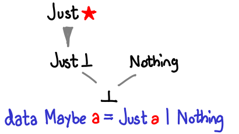

#Lecture 4: Options

---

#Imperative Error Handling

* Exceptions
* Sentinel Values
* flagged arguments

---

#Exceptions

    !scala
    def mean(xs: Seq[Double]): Double =
      if (xs.isEmpty)
        throw new ArithmeticException("NaN")
      else xs.sum / xs.length

---

The mean function is an example of what’s called a partial function: it’s not defined for some inputs.

A function is typically partial because it makes some assumptions about its inputs that aren’t implied by the input types.

---

#Sentinel Values

    !scala
    def mean1(xs: Seq[Double]): Double =
      if (xs.isEmpty) Double.NaN
      else xs.sum / xs.length

---

#Flagged Arguments

    !scala
    def mean2(xs: Seq[Double], empty: Double): Double =
      if (xs.isEmpty) empty
      else xs.sum / xs.length

---

Exceptions are not type-safe or referentially transparent.

The type of `mean`, `Seq[Double]) => Double` tells us nothing about the fact that exceptions may occur, and the compiler will not force callers of `mean` to make a decision about how to handle those exceptions.

---

`Option` is a *container* that may or may not hold something.

`Option` containers can be *chained* together, with `flatMap`.

---

`Option` itself is generic and has two subclasses: Some[T] or None

    !scala
    trait Option[+A] //base trait
    case class Some[+A](get: A) extends Option[A]
    case object None extends Option[Nothing]

---

`Option`s are like `List`s with at most a single element.

    !scala
    trait List[+A] //base trait
    case class Cons[+A](head: A, tail: List[A])
	  extends List[A]
    case object Nil
	  extends List[Nothing]

---

#Failure is an `Option`

`Option` tells you that a function might not return what you’re asking for.

    val numbers = Map("one" -> 1, "two" -> 2)
    //numbers: Map(one -> 1, two -> 2)
    numbers.get("two")
    //res0: Option[Int] = Some(2)
    numbers.get("three")
    //res1: Option[Int] = None

---

#Application: Computing a mean

    !scala
    def mean(xs: Seq[Double]): Option[Double] =
      if (xs.isEmpty) None
      else Some(xs.sum / xs.length)

---

The basic interface for Option consists of three methods:

    !scala
    trait Option[+A] {
      def unit[A](a: A): Option[A]
      def flatMap[B](f: A => Option[B]): Option[B]
      def map[B](f: A => B): Option[B] =
        flatMap(f andThen unit)
    }

---

Here is a hard-coded version of `map`:

    !scala
    def map[B](f: A => B): Option[B] =
  	  this match {
          case None => None
          case Some(a) => Some(f(a))
        }

---

#`flatMap` for `Option`

    !scala
    def flatMap[B](f: A => Option[B]): Option[B] =
  	  this match {
          case None => None
          case Some(a) => f(a)
        }

---

Combinators for safely exiting the `Option` monad:

* [`fold`](https://github.com/typelevel/cats/blob/master/core/src/main/scala/cats/Foldable.scala)
* [`getOrElse`](https://github.com/typelevel/cats/blob/master/core/src/main/scala/cats/data/OptionT.scala)

---

    !scala
    def getOrElse[B>:A](default: => B): B =
  	  this match {
          case None => default
          case Some(a) => a
        }

We will explain the necessity of the lower type bound generic `B` in the `getOrElse` combinator in a bit.

---

#Exercise

Implement `flatMap` using `map` & `getOrElse`.

---

---

    !scala
    def flatMap1[B](f: A => Option[B]): Option[B] =
      map(f) getOrElse None

---

# Try

`Try` is a general-purpose function for converting from an exception-based API to a container-based API.

  	!scala
  	def Try[A](a: => A): Option[A] =
  	  try { Some(a) }
  	  catch { case e: Exception => None }

The `None` returned is not informative about the exception thrown.  Next lecture's type `Either` fixes this.

---

`=>` in a function argument means the argument is lazy.  `=>` does not memoize.
If `a` were evaluated eagerly, an exception thrown in its evaluation would be outside the try-catch clause.

Think of lazy argument `a: => A` as a function with no input: `() => A`.

  	!scala
  	def Try[A](lazyA: () => A): Option[A] =
  	  try { Some( lazyA() ) }
  	  catch { case e: Exception => None }

---

Note that the Scala std lib has a type constructor `Try[_]`, but it is not monadic:

    !scala
    import scala.util.{Try, Success}
    def verify(n: Int): Try[Int] =
      if (n == 0) sys.error("nope") else Success(n)
    val x = Try(0).flatMap(verify)
    //x: Try[Int] = Failure(RuntimeException: nope)
    val y = verify(0)
    //RuntimeException: nope

---

We'll see another way to wrap a `Try` when we discuss the [`Validated` applicative](https://github.com/typelevel/cats/blob/master/core/src/main/scala/cats/data/Validated.scala):

    !scala
    def fromTry[A](t: Try[A]): Validated[Throwable, A] =
      t match {
        case Failure(e) => invalid(e)
        case Success(v) => valid(v)
    }
    def fromEither[A, B](e: Either[A, B]): Validated[A, B] =
      e.fold(invalid, valid)
    def fromOption[A, B](o: Option[B], ifNone: => A): Validated[A, B] =     
      o.fold(invalid[A, B](ifNone))(valid)

---

#`Option` in Cats

    !scala
    import cats.syntax.option._
    Some(3)
    //res0: Some[Int] = Some(3)
    3.some
    //res1: Option[Int] = Some(3)
    3.some.map { (i: Int) => i+2 }
    //res2: Option[Int] = Some(5)

---

#Reduction of for loops

    !scala
    for {
      i <- List(0)
    } yield(i + 1)
    //res0: List[Int] = List(1)
    List(0) map {i => i + 1}
    //res1: List[Int] = List(1)

---

    !scala
    for {
      i <- List(1)
      j <- List(2)
    } yield (i, j)
    //res2: List[(Int, Int)] = List((1,2))
    List(1) flatMap {
      i => List(2) map {
        j => (i, j)
      }
    }
    //res3: List[(Int, Int)] = List((1,2))

---

#'Looping' over Options

    !scala
    for {
      x <- 3.some
      y <- 4.some
    } yield x+y
    //res0: Option[Int] = Some(7)
    3.some.flatMap { x =>
      4.some.map { y => x+y }
    }  			
    //res1: Option[Int] = Some(7)

---

    !scala
    val error = none
    for {
      x <- 3.some
      y <- error
    } yield (x,y)
    //res0: Option[(Int, Nothing)] = None

---

    !scala
    for {
      i <- List(1)
      j <- List()
    } yield (i,j)
    //res1: List[(Int, Nothing)] = List()

---

#Exercise

Implement a `map2` function with the following signature:

    !scala
    def map2[A,B,C](a: Option[A], b: Option[B])
      (f: (A, B) => C): Option[C]

---

---

    !scala
    def map2[A,B,C](a: Option[A], b: Option[B])
	   (f: (A, B) => C): Option[C] =
      a flatMap (aa => b map (bb => f(aa, bb)))

---

We could also implement `map2` with a for-comprehension:

    !scala
    def map2[A,B,C](a: Option[A], b: Option[B])
	  (f: (A, B) => C): Option[C] =   
      for {
        i <- a
        j <- b
      } yield f(i, j)

---

#Exercise

Provided a function `mean`,

  	!scala
  	mean(xs: Seq[Double]): Option[Double] = ...

implement a `variance` function with the following signature:

    !scala
    variance(xs: Seq[Double]): Option[Double]

---

---

    !scala
    def variance(xs: Seq[Double]): Option[Double] =
      mean(xs) flatMap { m =>
        mean(xs.map(x => math.pow(x - m, 2)))
	  }

---

#`sequence` and `traverse`

These are two combinators we will see repeatedly throughout the course:

    !scala
    def sequence[A](a: List[Option[A]]): Option[List[A]]
    def traverse[A, B](a: List[A])(f: A => Option[B]): Option[List[B]]

---

    !scala
    sequence(List(Some(1), Some(2)))
    //res0: Option[List[Int]] = Some(List(1, 2))
    sequence(List(Some(1), None))
    //res1: Option[List[Int]] = None

---

    !scala
    def foo(x: Int) = if (x==2) None else Some(x)
    traverse(List(1,2,3))(foo)
    //res2: Option[List[Int]] = None
    traverse(List(1,3,4))(foo)
    //res3: Option[List[Int]] = Some(List(1, 3, 4))

---

#Exercise

Implement `sequence[A](a: List[Option[A]]): Option[List[A]]`.

---

---

    !scala
    def sequence[A](a: List[Option[A]]):
      Option[List[A]] =
        a.foldRight[Option[List[A]]]
          (Some(Nil))
          ((x,y) => map2(x,y)(_ :: _))

---

    !scala
    def sequence1[A](a: List[Option[A]]):
      Option[List[A]] =
        a match {
          case Nil => Some(Nil)
          case h :: t => h flatMap (hh => sequence(t) map (hh :: _))
        }

---

`traverse` can be trivially implemented with `sequence` and `map`.

    !scala
    def traverse[A, B](a: List[A])(f: A => Option[B]):
  	  Option[List[B]] =
        sequence a.map(f)

However this implementation is inefficient.

---

#Exercise

Reimplement `traverse` so that it traverses the list only once.

---

---

    !scala
    def traverse[A, B] (a: List[A])(f: A => Option[B]):
      Option[List[B]] =
        a.foldRight[Option[List[B]]] (Some(Nil)) {
          (h,t) => map2(f(h),t)(_ :: _)
        }

---

    !scala
    def traverse1[A, B] (a: List[A])(f: A => Option[B]):
      Option[List[B]] =
        a match {
          case Nil => Some(Nil)
          case h :: t => f(h) flatMap {
            x: B => traverse(t)(f) map { xt => x :: xt }
          }
        }

---

    !scala
    def traverse2[A, B] (a: List[A])(
	  f: A => Option[B]): Option[List[B]] =
      a match {
        case Nil => Some(Nil)
        case h :: t => traverse(t)(f) flatMap { xt =>
          f(h) map { x: B => x :: xt }
        }
      }

---

The fact that `traverse1` and `traverse2` are equivalent is a simple result of the Monad laws.

Note also that `traverse` is not equivalent to the other two, it uses only `map2` and is therefore an applicative functor.

We'll discuss this more in the weeks to come.

---

#Homework

Have a look at `Xor` and `Validated` in [*Cats*](https://github.com/typelevel/cats).

---

#Links

* [Herding Cats](http://eed3si9n.com/herding-cats)
* [Advanced Scala with Cats](http://underscore.io/books/advanced-scala/)
