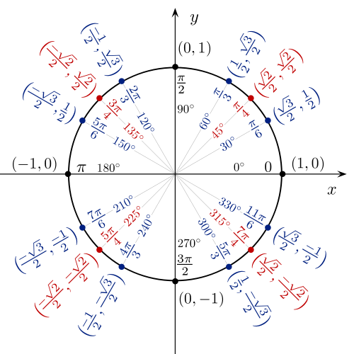
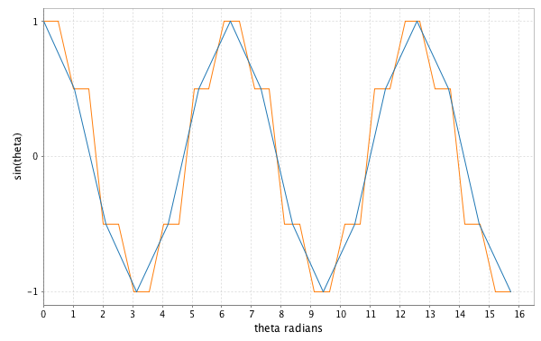

#Lecture 5: Laziness and Streams

---

"Separation of program description from evaluation" is promised to us at the beginning of this book.  Laziness is a fundamental component of this.
 
 
 
 

We will write *descriptions* for infinitely long processes, but only *evaluate* them for a finite length of time, or within some bound.
 
 
 
 

First we must review Scala's syntax for laziness, then we will see a data structure that separates "description from evaluation": `Stream`

---

#Example: Transposing a Computation

    !scala
    def foo(i: Int) = {println(i); i + 10}
    def bar(i: Int) = {println(i); i % 2 == 0}
    Stream(1,2,3).map(foo).filter(bar).force
    //1
    //11
    //2
    //12
    //3
    //13
    //res0: Stream[Int] = Stream(12)

---

    !scala
    List(1,2,3).map(foo).filter(bar)
    //1
    //2
    //3
    //11
    //12
    //13
    //res1: List[Int] = List(12)

---

#Eval Monad

`cats.Eval` is a monad that allows us to abstract over different models of evalua on. We typically hear of two such models: eager and lazy. Eval throws in a further dis nc on of memoized and unmemoized to create three models of evalua on:
• now—evaluatedonceimmediately(equivalenttoval);
• later—evaluatedoncewhenvalueisneeded(equivalenttolazyval); • always—evaluatedevery mevalueisneeded(equivalenttodef).

---

What do these terms mean?

Eager computa ons happen immediately, whereas lazy computations happen on access.

For example, Scala vals are eager defini ons. We can see this using a computa on with a visible side-effect. In the following example, the code to compute the value of x happens eagerly at the defini on site. Accessing x simply recalls the stored value without re-running the code.

val x = { println("Computing X") 1+1
}
// Computing X
// x: Int = 2
x // first access // res0: Int = 2
x // second access // res1: Int = 2

---

By contrast, defs are lazy and not memoized. The code to compute y below is not run un l we access it (lazy), and is re-run on every access (not memoized):
def y = { println("Computing Y") 1+1
}
// y: Int
y // first access // Computing Y
// res2: Int = 2
y // second access // Computing Y
// res3: Int = 2

---

Last but not least, lazy vals are eager and memoized. The code to compute z below is not run un l we access it for the first  me (lazy). The result is then cached and re-used on subsequent accesses (memoized):

lazy val z = { println("Computing Z") 1+1
}
// z: Int = <lazy>
z // first access // Computing Z
// res4: Int = 2
z // second access // res5: Int = 2

---

Eval has three subtypes: Eval.Now, Eval.Later, and Eval.Always. We construct these with three construc- tor methods, which create instances of the three classes and return them typed as Eval:
import cats.Eval
// import cats.Eval
val now = Eval.now(1 + 2)
// now: cats.Eval[Int] = Now(3)
val later = Eval.later(3 + 4)
// later: cats.Eval[Int] = cats.Later@10ab850e
val always = Eval.always(5 + 6)
// always: cats.Eval[Int] = cats.Always@f76e9a0
We can extract the result of an Eval using its value method:
now.value
// res6: Int = 3
later.value
// res7: Int = 7
always.value
// res8: Int = 11

---

Each type of Eval calculates its result using one of the evalua on models defined above. Eval.now captures a value right now. Its seman cs are similar to a val—eager and memoized:

val x = Eval.now { println("Computing X") 1+1
}
// Computing X
// x: cats.Eval[Int] = Now(2)
x.value // first access // res9: Int = 2
x.value // second access // res10: Int = 2

---

Eval.always captures a lazy computa on, similar to a def:
val y = Eval.always { println("Computing Y") 1+1
}
// y: cats.Eval[Int] = cats.Always@fc4a7df
y.value // first access // Computing Y
// res11: Int = 2
y.value // second access // Computing Y
// res12: Int = 2

---

Finally, Eval.later captures a lazy computa on and memoizes the result, similar to a lazy val:
val z = Eval.later { println("Computing Z") 1+1
}
// z: cats.Eval[Int] = cats.Later@56d1796c
z.value // first access // Computing Z
// res13: Int = 2
z.value // second access // res14: Int = 2

---

The three behaviours are summarized below:

<table class="tg">
 <tr>
   <th class="tg-9hbo"></th>
   <th class="tg-9hbo">Eager</th>
   <th class="tg-9hbo">Lazy</th>
 </tr>
 <tr>
   <td class="tg-9hbo">Memoized</td>
   <td class="tg-yw4l">`val, Eval.now`</th>
   <td class="tg-yw4l">`lazy val, Eval.later`</th>
 </tr>
 <tr>
   <td class="tg-9hbo">Not Memoized</td>
   <td class="tg-yw4l">-</th>   
   <td class="tg-yw4l">`def, Eval.always`</th>
 </tr>
</table>

---

Eval's map and flatMap methods add computa ons to a chain.

This is similar to the map and flatMap meththods on `scala.concurrent.Future`, except that the computations aren’t run until we call value to obtain a result:

val greeting = Eval.always { println("Step 1")
"Hello"
}.map { str =>
  println("Step 2")
  str + " world"
}
// greeting: cats.Eval[String] = cats.Eval$$anon$8@411b9c5f
greeting.value
// Step 1
// Step 2
// res15: String = Hello world

---

Note that, while the seman cs of the origina ng Eval instances are maintained, mapping func ons are always called lazily on demand:

val ans = for {
a <- Eval.now { println("Calculating A") ; 40 } b <- Eval.always { println("Calculating B") ; 2 }
} yield {
println("Adding A and B") a+b
}
// Calculating A
// ans: cats.Eval[Int] = cats.Eval$$anon$8@1bc45591
ans.value // first access // Calculating B
// Adding A and B
// res16: Int = 42
ans.value // second access // Calculating B
// Adding A and B
// res17: Int = 42

---

We can use Eval's memoize method to memoize a chain of computa ons. Calcula ons before the call to memoize are cached, whereas calcula ons a er the call retain their original seman cs:
val saying = Eval.always { println("Step 1") ; "The cat" }. map { str => println("Step 2") ; str + " sat on" }. memoize.
map { str => println("Step 3") ; str + " the mat" }
// saying: cats.Eval[String] = cats.Eval$$anon$8@24c1a639
52 CHAPTER4. MONADS
saying.value // first access // Step 1
// Step 2
// Step 3
// res18: String = The cat sat on the mat
saying.value // second access
// Step 3
// res19: String = The cat sat on the mat

---

more (trampolines) on p 52
---

#`val`

[Call-by-value](https://en.wikipedia.org/wiki/Evaluation_strategy#Call_by_value)
 
 

Strict/eager, memoizes
 
 

	!scala
	val foo = 5 + 5
	println(foo)

.notes: This program is evaluated line by line, from top to bottom.  The cost of time in calculating `5+5` is paid on the first line.  This cost will only be paid once, ever, for any use of `foo`.

---

#`lazy val`

[Call-by-need](https://en.wikipedia.org/wiki/Evaluation_strategy#Call_by_need)
 
 

lazy, memoizes
 
 

	!scala
	lazy val foo = 5 + 5
	println(foo)

.notes: The cost of time and memory in calculating `5+5` is paid on the second line.  This cost will only be paid once, ever, for any use of `foo`.

---

#`def`

[Call-by-name](https://en.wikipedia.org/wiki/Evaluation_strategy#Call_by_name)
 
 

lazy, does not memoize
 
 

	!scala
	def foo = 5 + 5
	println(foo)

 
 
 
 
 
 

[Call-by-need versus call-by-name](http://stackoverflow.com/a/8822824/1007926)

.notes: The cost of time and memory in calculating `5+5` is paid on the second line.  This cost will be incurred every time `foo` is used.

---

# Thunk

A ["thunk"](https://en.wikipedia.org/wiki/Thunk#Functional_programming) uses a function to provide *laziness*:

	!scala
	val thunk: () => Int = () => 123

 
 
 
 

`expensive` will not be called until the thunk is called.

	!scala
	val thunk2: () => Long = () => expensive()

	// cost incurred here
	val expensiveResult = thunk2()
 
 
 
 
 
 

[Comments on evaluation strategies](https://wiki.haskell.org/Lazy_vs._non-strict)

.notes: *Wikipedia* says that a "thunk" in Haskell memoizes.  This is not true in Scala.

---

# Arguments to a function

[Call-by-name](https://en.wikipedia.org/wiki/Evaluation_strategy#Call_by_name) with `=>`
 
 
Avoid the evaluation of the `B` value if the `A` value is available
 

	!scala
	sealed trait Option[+A] {
	  ...
	  def getOrElse[B >: A](default: => B): B =
	    this match {
          case Some(get) => get
          case None => default
        }
	  ...
	}

 
in `common.lecture4.FPOption`
 
 
 
 
See [Section 9.5 of *Programming in Scala*](http://www.artima.com/pins1ed/control-abstraction.html#9.5)

.notes: I feel this call-by-name syntax is far more understandable/justifiable after seeing the Stream combinators.  Some Stream combinators cannot be implemented without call-by-name syntax.  Outside of the context of lazy data structures like Stream, the only justification for call-by-name syntax is "short-circuiting" and avoiding the evaluation of expensive expressions, a.f.a.i.k.  "Separation of description from evaluation" encompasses (1) short-circuiting, (2) avoiding the evaluation of unnecessary, expensive expressions, and (3) lazy data structures.

---

#List (eager)

	!scala
	// abstract
	sealed trait List[+A]
	// concrete
	case object Nil
	  extends List[Nothing]
	case class Cons[+A](head: A,
	                    tail: List[A])
	  extends List[A]

---

#Stream

a.k.a. lazy list

	!scala
	// abstract
	trait Stream[+A]
	// concrete
	case object Empty
	  extends Stream[Nothing]
	case class Cons[+C](h: () => C,
	                    t: () => Stream[C])
		extends Stream[C]

---

The most important difference between the two:

* the tail of `Cons` of `List` is *eager*
* the tail of `Cons` of `Stream` is *lazy*

Non-empty streams are also commonly used in comonadic computations. More on this later.  

---

Scala does not support `call-by-name` parameters in `case class`.

We use thunks as a work-around. A thunk is a function with no argument:

	!scala
	case class Cons[+C](h: () => C,
	                    t: () => Stream[C])
		extends Stream[C]

---

The chosen syntax for a call-by-name argument was probably chosen for its resemblance to a thunk.

	!scala
	// Compare
	def bar(x: => Int)
	// to
	def baz(x: () => Int)

---

  !scala
	Cons(() => 1,
	     () => Cons(() => 2,
	                () => Cons(() => 3,
			                   () => Cons(() => 4,
							              () => Empty
									     )
						      )

	               )
        )
	//res0 = Cons(<function0>,<function0>)

Note the type has been inferred as `Cons[Int]` rather than `Stream[Int]`.  We also encountered this issue with `List`.

.notes: Before "tying the knot" and introduction of `take`, I think its necessary to show a manually constructed `Stream` like this.  The stack trace of `take` on an infinite `Stream` will arrive at this finite Stream.

---
# Smart constructor

	!scala
	def cons[A](hd: => A, tl: => Stream[A]):
	  Stream[A] = {
	    lazy val head = hd
	    lazy val tail = tl
	    Cons(() => head, () => tail)
      }

	def empty[A]: Stream[A] = Empty

 
 
 

.notes: The `cons` smart constructor (1) memoizes (2) hides the thunks (3) assists with type inference.  Because of the type annotation `def cons[A](...): Stream[A]`, a constructed Cons will be inferred to be of type Stream, not of type Cons.  This is the same issue we encountered with Cons of List.  The `empty[A]` smart constructor only assists with type inference

---

Using the smart constructor

	scala> cons(1, cons(2, cons(3, cons(4, empty))))

	res1: common.lecture5.Stream[Int] =
	       Cons(<function0>,<function0>)

 
 
 
 
 
 

Type has been inferred correctly as `Stream[Int]`.

.notes: Equivalent to the structure two slides earlier.  Head and Tail elements of each Cons are lazy.  Call-by-name syntax in smart constructor removes need for thunks

---
#[Tying the Knot](https://github.com/fpinscala/fpinscala/wiki/Chapter-5:-Strictness-and-laziness#tying-the-knot)

With strict evaluation, `fibonacciHelper` would be an endless loop and lead to stack overflow.

	!scala
	def fibonacciHelper(a: Int, b: Int): Stream[Int] =
      Stream.cons(a, fibonacciHelper(b, a+b))

	val fibonacci: Stream[Int] = fibonacciHelper(0, 1)

	fibonacci.print(22)

 

output

	0, 1, 1, 2, 3, 5, 8, 13, 21, 34 ...

 

[Source](http://philwantsfish.github.io/scala/streamsandprimes)

.notes: It will still lead to stack overflow, but the lazy list gives us more control over this.  We still need to limit our consumption of the Fibonacci stream.  `print` will be explained later

---
# Challenge question

Use the `cons` smart constructor to implement a sine wave.  Implement the sine wave for multiples of π/3 radian, or multiples of π/2 radian.
 
 
Utilize `math.sqrt(Double): Double`
 
 

	!scala
	def sinePositive: Stream[Double] = ???

	def sineNegative: Stream[Double] =
      sinePositive.map { d => -1*d }

---
`sinePositive` corresponds to the top half of the unit circle, including `(1, 0)` and excluding `(-1, 0)`

---
# Answer

	!scala
	def sinePositive: Stream[Double] =
      Stream.cons(0,
        Stream.cons(1.0/2,
          Stream.cons(math.sqrt(3)/2,
            Stream.cons(1.0,
              Stream.cons(math.sqrt(3)/2,
                Stream.cons(1.0/2, sineNegative)
	  )))))

	def sineNegative: Stream[Double] =
      sinePositive.map { d => -1*d }

	sinePositive.print(32)

---

	0.0
	0.5
	0.8660254037844386
	1.0
	0.8660254037844386
	0.5
	-0.0
	-0.5
	-0.8660254037844386
	-1.0
	-0.8660254037844386
	-0.5
	0.0
	0.5
	...

---
# `from`

	!scala
	def from(i: Int): Stream[Int] =
	  cons(i, from(i + 1))

 
 
 
 

example

	scala> Stream.from(0).print(8)
	0
	1
	2
	3
	4
	5
	6
	7

---

# Challenge question

We can turn an infinite `Stream` into a finite `Stream` with `take.`  `take` is a method that exists inside the `Stream` trait.

`countFromZero.take(6)` will insert an `Empty` after the sixth element of the infinite `Stream`.

Complete the implementation of `take`:

	!scala
	trait Stream[+A] {
	  ...
      def take(n: Int): Stream[A] = this match {
	    case cons(head, lazyTail) if ??? => ???
		case cons(head, lazyTail) if ??? => ???
		case Empty => empty[A]
	  }
	  ...
	}
 
 

`print` relies upon `take`

---

---
# Answer

	!scala
	trait Stream[+A] {
	  ...
      def take(n: Int): Stream[A] = this match {
	    case cons(head, lazyTail) if n>0 =>
		  cons(h, lazyTail.take(n-1))
		case cons(head, lazyTail) if n<=0 =>
		  empty[A]
		case Empty =>
		  empty[A]
	  }
	  ...
	}

---
Trace

	from(0).take(4)
	cons(0, from(1).take(3))
	cons(0, cons(1, from(2).take(2)))
	cons(0, cons(1, cons(2, from(3).take(1))))
	cons(0, cons(1, cons(2, cons(3, from(4).take(0)))))
	cons(0, cons(1, cons(2, cons(3, Empty))))

.notes: Evaluation is explained later.  `take` is not evaluation.  If only two elements are evaluated, then this trace will be shortened.

---

#foldRight

`foldRight` on `List`

	!scala
	trait List[+A] {
	  ...
	  def foldRight[B](z: B)
	                  (f: (A, B) => B): B =
        as match {
          case Nil => z
          case Cons(a, tail) =>
		    f(a, tail.foldRight(z)(f))
        }
	  ...
    }

---

`foldRight` on `Stream`

	!scala
	trait Stream[+A] {
	  ...
      def foldRight[B](z: => B)
		              (f: (A, => B) => B): B =
	    this match {
		  case Empty => z
		  case cons(head, lazyTail) =>
		    f(head, lazyTail.foldRight(z)(f))
		}
	  ...
    }

.notes: Remind them lazy tail in Stream.cons; case class Cons[+C](h: () => C, t: () => Stream[C])

---

`foldRight` is not suitable to be used on an infinite `Stream`.

Furthermore, `foldRight` is not tail-recursive.
 
 
 
 

	!scala
	trait Stream[+A] {
	  ...
      def foldRight[B](z: => B)
		              (f: (A, => B) => B): B = ...
	  ...
    }

.notes: Point out which combinators on `Stream` are suitable to be used on an infinite `Stream`, and which are not

---

Limit an infinite `Stream` to a finite length with `take` before calling `foldRight`.  

Despite this precaution, a `Stream` of finite length [may still overflow the stack because of `foldRight`'s tail-calls.](https://groups.google.com/forum/#!topic/scala-functional/MKZ5olHHSwQ)

 
 

	!scala
    val summed =
	  Stream.from(0).take(100).foldRight(0)(_+_)

	println(s"sum of 0 to 99, inclusive = $summed")

	// sum of 0 to 99, inclusive = 4950

---
#map

	!scala
	trait Stream[+A] {
	  ...
	  def map[B](f: A => B): Stream[B] = {
        def g(a: A, sb: => Stream[B]): Stream[B] =
	      cons(f(a), sb)

        foldRight(empty[B])(g)
      }
	  ...
	}

---

	!scala
	val radians: Stream[Double] =
	  Stream.from(0).map { i =>
	                       i.toDouble * math.Pi / 3 }

	val cosineWave: Stream[Double] =
	  radians.map { d => math.cos(d) }

 
 
 
 
 
 

.notes: An implementation of `map` on an `Array` can process the elements in parallel because an `Array` provides O(1) access to any element.  An implementation of `map` on a `List` cannot process the elements in parallel because a `List` provides O(n) access to any element.  Mapping over a List occurs sequentially.  Understanding this, it is more intuitive how `map` on a `Stream` is sequential and lazy.  In this example, `66.toChar` preceed the lazy evaluation of `67.toChar`, and so on.  Anyone who thinks mapping over a `List` happens "all at once" will be confused by mapping over a Stream.

---

---
#flatMap

	!scala
	trait Stream[+A] {
	  ...
	  def append[B >: A](appended: Stream[B]):
	    Stream[B] = ...

	  def flatMap[B](f: A => Stream[B]):
	    Stream[B] = {
        def g(a: A, sb: => Stream[B]) =
          f(a).append(sb)

        foldRight(empty[B])(g)
      }
	  ...
    }

.notes: It is impossible for `map` to lengthen the Stream.  `flatMap` can do this.  We can interpolate more points in the sine wave with `flatMap`

---

	!scala
	// def flatMap[B](f: A => Stream[B]): Stream[B]

	val interpolatedSineWave: Stream[Double] =
	  sineWave.take(32).flatMap { d =>
        Stream.cons(d, Stream.cons(d, Stream.empty))
      }

 
 
 
 
 
 

in `slideCode.lecture5.SineWave`

---

---
# Evaluation

Exiting the `Stream`

	!scala
	trait Stream[+A] {
	  ...
	  def print(upTo: Int): Unit = {
        def f(a: A, remaining: => Int): Int = {
          println(a)
          remaining - 1
        }
        this.take(upTo).foldRight(upTo)(f)
      }
      ...
	}

---

	!scala
	trait Stream[+A] {
	  ...
	  def force(n: Int): List[A] = {
        def f(a: A, la: => List[A]) = a::la

        this.take(n).foldRight(List[A]())(f)
      }
      ...
	}

---

	!scala
    def sum(s: Stream[Int], maxElements: Int): Int = {
      def f(i: Int, s: => Int) = i + s
      s.take(maxElements).foldRight(0)(f)
    }
 
 

Usage

	scala> from(4)
	res0: fpinscala.laziness.Stream[Int] =
	  Cons(<function0>,<function0>)

	scala> sum(from(4), 10)
	res1: Int = 85

---

#unfold

`unfold` helps to create `Stream`s

 
 

	!scala
	def unfold[A, S](z: S)(f: S => Option[(A, S)]):
	  Stream[A]

---

Many of the exercises can be re-implemented with `unfold` -- often more cleanly.
 
 

	!scala
	def from(n: Int): Stream[Int] =
      unfold(n)((n0: Int) => Some(n0, n0+1))

	from(5).print(6)
	// 5
	// 6
	// 7
	// 8
	// 9
	// 10

 
 

in `common.lecture5.StreamExamples`

---

	!scala
	def fromTo(lowerInclusive: Int,
	           upperExclusive: Int):Stream[Int]=
      unfold(lowerInclusive){(n0: Int) =>
        if (n0 < upperExclusive) Some(n0, n0+1)
        else None
      }

	fromTo(5,8).print(6)
	// 5
	// 6
	// 7
	// Stream ends before 6 elements can be printed

 

in `common.lecture5.StreamExamples`

---

#Homework

Read Chapter 6 of _Functional Programming in Scala_.
