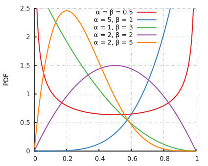
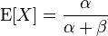

#Lecture 8: Property-based Testing

---

Chapter 8 revolves around *Generators* and *Properties*.

 

A *Generator* provides pseudo-random test cases.  A Generator is entirely deterministic - tests are reproducible.  It is based upon `Rand` from Chapter 6.

A *Property* is something that should hold true for an unknown number of test cases.

 

The tools of Chapter 8 are available in the [ScalaCheck library](https://www.scalacheck.org/).  ScalaCheck and Chapter 8 both provide [property-based testing](https://en.wikipedia.org/wiki/QuickCheck).

We have simplified the book's implementation.

---
# Gen

	!scala
	case class Gen[A](rand: RNG => (A, RNG))

    // [Int.MinValue, Int.MaxValue]
    val genUniformInt: Gen[Int] = ...

    // [0, Int.MaxValue]
    val genUniformIntNonNegative: Gen[Int] =
      genUniformInt.map( i => i.abs )

	// true or false
    val genBoolean: Gen[Boolean] =
      genUniformInt.map(i => i >= 0)

---

	!scala
	def forAll[A](genA: Gen[A])(p: A => Boolean): Prop
	  = ...  

Proposition will hold true for every value `A` generated by `Gen[A]`.

Otherwise, proposition will be falsified.

The number of tests to prove or falsify the proposition, and `Gen[A]`'s seed `RNG`, are not yet provided.

---
#Prop

	!scala
	//         number of tests, seed => Result
	case class Prop(run: (Int, RNG) => Result)

	case class Gen[A](rand: RNG => (A, RNG))

---

In our implementation, when a *Property* is tested for a fixed number of test cases,

it produces an `Xor[NonEmptyList[String], List[String]]`.

 

This `Xor` will be

	!scala
	Left(...):  Xor[NonEmptyList[String], Nothing]
	// test failed

or

	!scala
	Right(...): Xor[Nothing, List[String]]
	// test passed

---

---

# Testing our Beta Distribution Sampler

In lab 6 we sampled from a Beta distribution.  

Before, we set *alpha* = 2 and *beta* = 2.  Our PDF was the purple line.

[Picture source](https://en.wikipedia.org/wiki/Beta_distribution)

---

We will generate Beta distributions with various $\alpha and \$beta,

then compare the theoretical mean with the sample mean for each.

If the difference between the theoretical mean and the sample mean exceeds a fixed threshold, the test will fail.

---

# Beta sampler

	!scala
	case class BetaDistributionSampling(
	  c: Double, alpha: Double, beta: Double) {

	  // Beta PDF
	  def f(x: Double): Double =
        math.pow(x, alpha - 1) *
		  math.pow((1 - x), beta - 1)

	  val sample: Rand[(Double, Double)] =
        both(uniformDoublePositive,
		     uniformDoublePositiveUpTo(c))

	  ...

`slideCode.lecture6.BetaDistributionSampling`

---

# Beta sampler

	!scala
	  ...
	  def accepted(tup: Tuple2[Double, Double]):
	      Boolean = {
        val x = tup._1
        val y = tup._2
        if (y < f(x)) true
        else false
      }
      val acceptedSamples:
	    Rand[Tuple2[Double, Double]] =
        rejectionSampler(sample)(accepted)
      val acceptedX: Rand[Double] =
        map(acceptedSamples)(tup => tup._1)
	}

`slideCode.lecture6.BetaDistributionSampling`

---

# Generating Beta distributions

	!scala
	val genBetaDistribution:
	  Gen[BetaDistributionSampling] =
      genUniformDoublePositiveUpTo(5.0).flatMap {
	    alpha =>
        genUniformDoublePositiveUpTo(5.0).map {
		  beta =>
          // println(s"alpha: $alpha  beta: $beta")

          BetaDistributionSampling(5.0, alpha, beta)
      }
    }

`slidecode.lecture8.TestingBetaDistributions`

---

# Pulling values out of the Generator

	!scala
	case class BetaDistributionSampling(
	  c: Double, alpha: Double, beta: Double) { ... }

Pulling 16 values out of `genBetaDistribution: Gen[BetaDistributionSampling]`

	BetaDistributionSampling(5.0,1.59,3.91)
	BetaDistributionSampling(5.0,0.61,3.79)
	BetaDistributionSampling(5.0,4.47,4.12)
	BetaDistributionSampling(5.0,3.26,4.62)
	BetaDistributionSampling(5.0,0.29,1.77)
	BetaDistributionSampling(5.0,1.57,3.94)
	...

---

From each Beta distribution, we want 512 samples.  We need to pass along the alpha and beta, as well.

	!scala
	val genBetaDistributionSamples:
	           // alpha   beta    samples
	  Gen[Tuple3[Double, Double, List[Double]]] =
      genBetaDistribution.flatMap {
	    betaDistributionSampler => ...
	  }

---

From each alpha, beta, and list of samples, we want a theoretical mean and a sample mean.

	!scala
    val genBetaDistributionMean:
	    //  theoretical mean,  sample mean
	  Gen[Tuple2[Double, Double]] =
      genBetaDistributionSamples.map { ... }

---
# Producing the Property

We will use `forAll` to produce a `Prop`.

Signature of the `forAll` method:

	!scala
	def forAll[A](genA: Gen[A])(p: A => Boolean): Prop

Signature of the `forAll` method in this usage:

	!scala
	def forAll[Tuple2[Double,Double]]
	  (genA: Gen[Tuple2[Double,Double]]])
	  (p: Tuple2[Double,Double] => Boolean): Prop

We need to implement the predicate.

---
# Predicate for testing Beta distributions

	!scala
    val diffLimit = 0.5

	def betaDistributionPredicate(
	  tup: Tuple2[Double, Double]): Boolean = {
      val theoreticalMean = tup._1
      val actualMean = tup._2

      val diff = (theoreticalMean - actualMean).abs

      diff < diffLimit
    }

---

# We have a Property

	!scala
	val betaDistributionProp: Prop =
	  forAll(genBetaDistributionMean)
	        (betaDistributionPredicate)

---

# Running the Property

	!scala
	val simpleSeed = RNG(123.toLong)

    val tp: TestParameters =
	  TestParameters(32, 16, simpleSeed)

	val betaDistributionResult: Result =
      betaDistributionProp.run(tp)

	println(s"Beta distribution theoretical
	  mean and actual mean should be
	  less than $diffLimit apart")
	println(betaDistributionResult)

---
# Successful for 16 test cases

	a = (0.518,0.512)  rng1 = RNG(281224260715694)
	a = (0.738,0.739)  rng1 = RNG(16414381877132)
	a = (0.610,0.581)  rng1 = RNG(227948167035286)
	a = (0.640,0.621)  rng1 = RNG(243689560722)
	a = (0.520,0.523)  rng1 = RNG(278578944958020)
	a = (0.988,0.710)  rng1 = RNG(73703246433449)
	a = (0.760,0.761)  rng1 = RNG(278677516185330)
	...
	Beta distribution theoretical mean and
	  actual mean should be less than 0.5 apart
    Passed

---

# Tests for production with ScalaCheck

	!scala
	case class UnvalidatedWebForm(firstName: String,
	  lastName: String, phoneNumber: Long,
	  email: String)

	case class ValidatedWebForm(firstName: String,
	  lastName: String, phoneNumber: Long,
	  email: String)

    type XorErrors[E, A] = Xor[NonEmptyList[E], A]

We want to accumulate errors of type `E`, or pass along a validated `A`.

`Left` is a failed validation.

`Right` is a successful validation.

---

	!scala
	def isAlpha(string: String):
	  XorErrors[String, String] = ...

	def minimumLength(minLength: Int)(string: String):
	  XorErrors[String, String] = ...

	def numDigits(num: Long, length: Int):
	  XorErrors[String, Long] = ...

	def validateEmailAddress(emailAddress: String):
	  XorErrors[String, String]	= ...

	def validateWebForm
	  (unvalidatedWebForm: UnvalidatedWebForm):
      XorErrors[String, ValidatedWebForm] = ...

---

	unvalidated:
	UnvalidatedWebForm(P3t3r,Bec1ch,
	                   1234567890,no@suffix)
	validated:
	Left(
	 OneAnd(String P3t3r contains non-alpha characters,
	  List(Not a valid e-mail address: no@suffix,
	    String Bec1ch contains non-alpha characters)))

---

Code being tested:

	!scala
	package slideCode.lecture8
	case class UnvalidatedWebForm(...)
	object ValidatedWebForm { ... }
	case class ValidatedWebForm(...)

Found in:

`lectureCode/slideCode/src/main/
  scala/slideCode/lecture8/WebForm.scala`

In SBT:

`run`

---

Tests:

	!scala
	package slideCode.lecture8
	class WebFormSpec extends PropSpec
	  with GeneratorDrivenPropertyChecks
	  with Matchers { ... }

Found in:
`lectureCode/slideCode/src/test/
  scala/slideCode/lecture8/WebFormTest.scala`

In SBT:

`test`

---
# Generating successful web forms -- names

	!scala
    def genAlphaString(length: Int): Gen[String] =
      Gen.listOfN(length, Gen.alphaChar).map {
	    (listChar: List[Char]) =>
        listChar.foldRight("")(_+_)
      }

	val genNameSuccessful: Gen[String] =
      Gen.chooseNum(2, 16).flatMap(genAlphaString)
---

	!scala
	// Testing
	// def validateName(name: String):
	//   XorErrors[String, String] = { ... }

	property("`validateName` should accept alpha-only names
	          of length greater than 1 character") {
      forAll(genNameSuccessful) { name =>
        ValidatedWebForm.validateName(name).isRight
		  should be (true)
      }
    }

---
# Generating successful web forms -- phone numbers

	!scala
	val genPhoneNumberSevenDigit: Gen[Long] =
      Gen.chooseNum(1000.toLong, 9999.toLong).
	    map((l: Long) => l*spire.math.pow(10, 3))

	val genPhoneNumberTenDigit: Gen[Long] = ...

	val genPhoneNumberSuccessful: Gen[Long] =
      Gen.oneOf(genPhoneNumberSevenDigit,
	            genPhoneNumberTenDigit)

---

	!scala
	// Testing
    // def validatePhoneNumber(phoneNumber: Long):
	//   XorErrors[String, Long] = { ... }

	property("`validatePhoneNumber` should accept
	           phone numbers of 7 digits,
			   that do not begin with 0") {
      forAll(genPhoneNumberSevenDigit) { phone =>
	    ValidatedWebForm.
		  validatePhoneNumber(phone).isRight
		  should be (true)
      }
    }

---
# Generating successful web forms -- email addresses

	!scala
	val genSuffix: Gen[String] =
	  Gen.oneOf("com","net","biz","co")

	val genEmailAddressSuccessful: Gen[String] =
		...map { ... =>
      name + "@" + domain + "." + suffix
	}

---
# Challenge question

	!scala
	genNameSuccessful: Gen[String]
	genPhoneNumberSuccessful: Gen[Long]
	genEmailAddressSuccessful: Gen[String]

	// want:
	genUnvalidatedWebFormSuccessful:
	  Gen[UnvalidatedWebForm] = ???

	case class UnvalidatedWebForm(firstName: String,
	  lastName: String, phoneNumber: Long,
	  email: String)

---

---

# Putting the names, phone numbers, and email addresses together

	!scala
	val genUnvalidatedWebFormSuccessful:
	  Gen[UnvalidatedWebForm] =
      genNameSuccessful.flatMap { firstName =>
        genNameSuccessful.flatMap { lastName =>
		  genPhoneNumberSuccessful.flatMap { phone =>		
            genEmailAddressSuccessful.map { email =>
              UnvalidatedWebForm(firstName, lastName,
			                     phone, email)
            }
          }
        }
      }

---

	!scala
	// Testing
	// def validateWebForm
	//  (unvalidatedWebForm: UnvalidatedWebForm):
    //   XorErrors[String, ValidatedWebForm] = { ... }

	property("`validateWebForm` should accept these
	          unvalidated web forms") {
      check {
        Prop.forAllNoShrink
		  (genUnvalidatedWebFormSuccessful){ form =>
          ValidatedWebForm.
		    validateWebForm(form).
			isRight
        }
      } }

---
# Generating failing web forms

	!scala
    def genAlphaNumericString(length: Int):
	  Gen[String] = ...

	val genNameNumericFailing: Gen[String] =
      Gen.chooseNum(1, 16).
	    flatMap(genAlphaNumericString)

	val genPhoneNumberWrongLength: Gen[Long] = ...

	val genEmailAddressNoDomainFailing: Gen[String]

	  = ...

	val genUnvalidatedWebFormSuccessful:
	  Gen[UnvalidatedWebForm] = ...

---

	!scala
	property("`validatePhoneNumber` should reject
	  phone numbers that are not 7 or 10 digits") {
      forAll(genPhoneNumberWrongLength) { phone =>
        ValidatedWebForm.
		  validatePhoneNumber(phone).
		  isRight
		  should be (false)
      }
    }

Equivalently

	!scala

	      isLeft
		  should be (true)

---
# Output

	WebFormSpec:
	- `validateName` should accept alpha-only
	   names of length greater than 1 character
	- `validateName` should reject names with
	   numeric characters
	- `validateName` should reject names of
	   length 1 character
	- `validatePhoneNumber` should accept
	  phone numbers of 7 digits, that
	  ...

	Suites: completed 1, aborted 0
	Tests: succeeded 12, failed 0, canceled 0,
	    ignored 0, pending 0

---

 [&& in ScalaCheck's `Prop`](https://www.scalacheck.org/files/scalacheck_2.11-1.12.5-api/index.html#org.scalacheck.Prop@&&%28p:=%3Eorg.scalacheck.Prop%29:org.scalacheck.Prop)

---

#Homework

Read Chapter 9 of _Functional Programming in Scala_.
