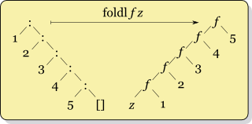

# Lecture 2 Tutorial: Folding

-------------------

## Part 0: Setup

### Task (0a)
In your editor of choice, open `../tutorial/src/main/scala/com/datascience/education/tutorial/lecture2/Folding.scala`.

### Task (0b)
* In a terminal, navigate to `../tutorial/src/main/scala/com/datascience/education/tutorial/lecture2/`
* Enter `scala-2.11 -i Folding.scala`.  Warnings can be ignored.
```
bash-3.2$ scala-2.11 -i Folding.scala
Loading Folding.scala...
defined object Folding
Welcome to Scala version 2.11.7 (Java HotSpot(TM) 64-Bit Server VM, Java 1.8.0_74).
Type in expressions to have them evaluated.
Type :help for more information.
scala>
```

* import the members of `object Folding` 
```
scala> import Folding._
import Folding._
scala> 
```
* enter `myToString(List(1,2,3,4,5))`
```
scala>   myToString(List(1,2,3,4,5))
res0: String = Cons(1, Cons(2, Cons(3, Cons(4, Cons(5, Nil)))))
scala> 
```

## Part 1: Refactoring with `foldRight`

### (1a): Background
`myToString` is a very simple [pretty printer](http://www.lihaoyi.com/upickle-pprint/pprint/).  

"pretty" is subjective.  In this context, we want to print the `List` in a way that exposes its structure.

The default `String` representation of a `List` makes it look more like an `Array` or `Vector`.
```
scala> List(1,2,3,4)
res1: List[Int] = List(1, 2, 3, 4)
```
We want to depict our `List` as the linked list that it is.
```
scala> myToString(List(1,2,3,4))
res2: String = Cons(1, Cons(2, Cons(3, Cons(4, Nil))))
```

### (1b): Refactoring using `foldRight`
We are provided an implementation of `foldRight` -- in (2a)

```
  def foldRight[A, B](list: List[A], z: B)(f:(A, B) => B): B =
    list match {
      case Nil => z
      case x :: xs => f(x, foldRight(xs, z)(f))
    }
```

[Folding](https://en.wikipedia.org/wiki/Fold_(higher-order_function)) is initially less familiar than pattern matching and recursion, so it is understandable why pattern matching and recursion are taught first.  Pattern matching is particularly prevalent in Scala development that does not utilize functional programming -- plenty of people use Scala in this way.

*FP in Scala* contains exercises that ask you to use `foldLeft`, `foldRight` or other combinators rather than pattern matching.  We will do the same in this tutorial, to develop an intuition for folding.

A *primitive* combinator may be implemented with pattern matching.  Non-primitive combinators should be implemented on top of other combinators. Of course we can't implement combinator A on top of combinator B, and visa versa.  The implementations of `foldLeft` and `foldRight` below are *primitive*.

We will replace the patterning matching in `myToString` with `foldRight` in `myToString2`.

```
  def myToString[A](list: List[A]): String = list match {
    case Nil => "Nil"
    case head :: tail => "Cons(" + head + ", " + myToString(tail) + ")"
  }
  
  def myToString2(list: List[String]): String = ???
  
```

Let's fill in the generic types of `foldRight`.  We will use `foldRight` to fold a `List` of `String`s into a single `String`.

```
  def foldRight[A, B](list: List[A], z: B)(f: (A, B) => B): B = ...
  
  def myToString2(list: List[String]): String = 
    foldRight[String, String](list: List[String], z: String)(f: (String, String) => String)
                                                  ^ base case      ^ Next String in List
														    	            ^ Accumulated so far
															    			           ^ Next accumulation
```

If I were to print out the accumulating `String` at every step of `foldRight`, the steps would look like this.

```
scala> myToString(List(1,2,3,4))
  Nil
  Cons(4, Nil)
  Cons(3, Cons(4, Nil))
  Cons(2, Cons(3, Cons(4, Nil)))
  Cons(1, Cons(2, Cons(3, Cons(4, Nil))))
res2: String = Cons(1, Cons(2, Cons(3, Cons(4, Nil))))
```

Let's implement anonymous function `f`, to be used in `foldRight`

```
(next: String, accumulated: String) => "Cons(" + next + ", " + accumulated + ")"
```

Equivalently,

```
  def foo(head: String, tail: String): String =
    "Cons(" + head + ", " + tail + ")"
```

What is the base case?  What `String` will `foldRight` produce for an empty `List`?  "Nil"


```
  def myToString2(list: List[String]): String = foldRight(list,"Nil"){
    (next: String, accumulated: String) => "Cons(" + next + ", " + accumulated + ")"
  }
```

equivalently

```
  def myToString2(list: List[String]): String = foldRight(list,"Nil")(foo)
```

Try `myToString2` with a `List` of `String`s

```
scala>   myToString2(List("1","2","3","4","5"))

res5: String = Cons(1, Cons(2, Cons(3, Cons(4, Cons(5, Nil)))))
```

### (1c): Folding over a Generic
`myToString2` needs a fix.  
`myToString` will turn a List containing any type `A` into a String.  [Every type in Scala has a String representation](http://www.scala-lang.org/api/current/index.html#scala.Any@toString():String), so this is allowable.

```
  def myToString[A](list: List[A]): String = list match {
    case Nil => "Nil"
    case head :: tail => "Cons(" + head + ", " + myToString(tail) + ")"
                          //        ^^ implicit conversion from A to String
  }
```
Right now, `myToString2` will only take in `List[String]`
```
  def myToString2(list: List[String]): String = ???
```

We need to replace `foldRight[String, String]` with `foldRight[A,String]`

```
  def foo2[A](head: A, tail: String): String =
    "Cons(" + head + ", " + tail + ")"
		       ^^ implicit conversion from A to String
			   
  def myToString3[A](list: List[A]) = foldRight[A,String](list,"Nil")(foo2)
```
Problem solved

```
scala> myToString3(List(1,2,3,4))
res4: String = Cons(1, Cons(2, Cons(3, Cons(4, Nil))))
```

## Part 2: `foldRight` versus `foldLeft`
### (2a): `foldRight` intuition


```
  def foldRight[A, B](list: List[A], z: B)(f: (A, B) => B): B =
    list match {
      case Nil => z
      case x :: xs => f(x, foldRight(xs, z)(f))
    }
```

Here is a modified implementation of `foldRight` that prints the input and output of each call to `foldRightPrinter`.  It can be used to print stack traces.

```
  def foldRightPrinter[A, B](list: List[A], z: B)(f:(A, B) => B): B = {
    println(s"input: $list")
    val out: B = list match {
      case Nil => z
      case x :: xs => f(x, foldRightPrinter(xs, z)(f))
    }
    println(s"output: $out")
    out
  }

  def myToString3Printer[A](list: List[A]) =
    foldRightPrinter[A,String](list,"Nil")(foo2)
```

Stack trace of `myToString3Printer` with input `List(1,2,3,4)`

```
scala> myToString3Printer(List(1,2,3,4))
input: List(1, 2, 3, 4)
input: List(2, 3, 4)
input: List(3, 4)
input: List(4)
input: List()
output: Nil
output: Cons(4, Nil)
output: Cons(3, Cons(4, Nil))
output: Cons(2, Cons(3, Cons(4, Nil)))
output: Cons(1, Cons(2, Cons(3, Cons(4, Nil))))
res10: String = Cons(1, Cons(2, Cons(3, Cons(4, Nil))))
```

`List(1,2,3,4)` is the tree on the left.

Each application of `foo2` is an `f` in the tree on the right.

Each `f` must wait for the `f` below it to compute.

Each `f` "waits" on the stack.  `foldRight` uses memory in the stack proportionally to the size of its input `List`.


[Source](https://en.wikipedia.org/wiki/Fold_(higher-order_function))


### (2b): `foldLeft` intuition

Just as before,

`List(1,2,3,4)` is the tree on the left.

Each application of `foo2` is an `f` in the tree on the right,
 
*but* `foldLeft` *does not* use memory in the stack proportionally to the size of its input `List`.  `foldLeft` *does* reverse its input.  If your `f` is not commutative, you need to compensate for this.

In other words, each `f` does *not* have to wait.

Left unstated in this diagram is the reversal of the input `List`.  Note, in the `foldRight` diagram, `z` is combined with `5`.  In the `foldLeft` diagram, `z` is combined with `1`.



[Source](https://en.wikipedia.org/wiki/Fold_(higher-order_function))

```

  def foldRight[A, B](list: List[A], z: B)(f: (A, B) => B): B =
    list match {
      case Nil => z
      case head :: tail => f(head, foldRight(tail, z)(f))
	  //                            ^^ has to return before f can be applied
    }

  @annotation.tailrec
  def foldLeft[A,B](list: List[A], z: B)(f: (B, A) => B): B =
    list match {
      case Nil => z
      case head :: tail => foldLeft(tail, f(z, head))(f)
	  //                                  ^^ start combining at the end of the List
	  //                                     rather than at the beginning
    }
```
[\@annotation.tailrec](http://stackoverflow.com/questions/3114142/what-is-the-scala-annotation-to-ensure-a-tail-recursive-function-is-optimized)

An implementation of `foldLeft` for producing stack traces.

```
  def foldLeftPrinter[A,B](list: List[A], z: B)(f: (B, A) => B): B = {
    println(s"input: $list")
    val out: B = list match {
      case Nil => z
      case head :: tail => {
        val zi: B = f(z, head)
        println(s"f($z, $head) = $zi")
        foldLeftPrinter(tail, zi)(f)
      }
    }
    println(s"output: $out")
    out
  }
```

See below, `f` waits for nothing before it can be applied.

```
scala> myToString4Printer(List(1,2,3,4))
input: List(1, 2, 3, 4)
f(Nil, 1) = Cons(1, Nil)
input: List(2, 3, 4)
f(Cons(1, Nil), 2) = Cons(2, Cons(1, Nil))
input: List(3, 4)
f(Cons(2, Cons(1, Nil)), 3) = Cons(3, Cons(2, Cons(1, Nil)))
input: List(4)
f(Cons(3, Cons(2, Cons(1, Nil))), 4) = Cons(4, Cons(3, Cons(2, Cons(1, Nil))))
input: List()
output: Cons(4, Cons(3, Cons(2, Cons(1, Nil))))
output: Cons(4, Cons(3, Cons(2, Cons(1, Nil))))
output: Cons(4, Cons(3, Cons(2, Cons(1, Nil))))
output: Cons(4, Cons(3, Cons(2, Cons(1, Nil))))
output: Cons(4, Cons(3, Cons(2, Cons(1, Nil))))
res14: String = Cons(4, Cons(3, Cons(2, Cons(1, Nil))))
```

But notice that `res14: String` is reversed, compared to the `String` produced by `foldRight`.  Reversing the input to `myToString4` can compensate for this.  (`List` reversal has its own costs, of course.)


`foldLeftPrinter` actually breaks tail recursion.

The problem is `println(s"output: $out")`.

Intuitively, a recursive function is [*tail recursive*](https://en.wikipedia.org/wiki/Tail_call) if the recursion *exits* at the bottom.

```
  @annotation.tailrec
  def tailRecursive(i: Int): Int =
    if (i>100) i
    else tailRecursive(i+1)
```

A recursive function is *not* tail recursive if the recursion goes *down*, and then back *up*, to exit at the top.

```
  def notTailRecursive(i: Int): Int =
    if (i > 100) i
    else i + notTailRecursive(i+1)
	//     ^ work waits for notTailRecursive(i+1) to finish
```

### (2c): `foldRight` implemented with `foldLeft`

We saw in Part 1e that `foldLeft` behaves like `foldRight` *but* its output is reversed.

If your fold operation `f` is commutative, you'll never notice the difference.

```
  def sumFoldRight(list: List[Int]): Int =
    foldRight(list, 0)((next: Int, sum: Int) => next+sum)

  def sumFoldLeft(list: List[Int]): Int =
    foldLeft(list, 0)((sum: Int, next: Int) => next+sum)
```

Our string building function is *not* commutative, so we *do* notice the difference.

We also saw in Part 1e that this negative aspect of `foldLeft` can be compensated for my reversing the input to `foldLeft`.

```
// with foldRight
scala> myToString3(List(1,2,3,4))
res17: String = Cons(1, Cons(2, Cons(3, Cons(4, Nil))))

// with foldLeft
scala> myToString4(List(1,2,3,4))
res15: String = Cons(4, Cons(3, Cons(2, Cons(1, Nil))))

// with foldLeft
scala> myToString4(List(4,3,2,1))
res16: String = Cons(1, Cons(2, Cons(3, Cons(4, Nil))))
```

Lets bake this fix into a new function, `foldRightViaFoldLeft`.

```
def foldRight[A, B](list: List[A], z: B)(f:(A, B) => B): B = ...

@annotation.tailrec
def foldLeft[A,B](list: List[A], z: B)(f: (B, A) => B): B = ...
```
The arguments to `f` are reversed in `foldRight` and `foldLeft`. `f:(A, B) => B` versus `f:(B, A) => B`.
The reversal has meaning later in the book, with lazy folding on `Stream`s.

We compensate for this reversal with an anonymous function, `(b: B, a: A) => f(a,b)`
```
def foldRightViaFoldLeft[A,B](l: List[A], z: B)(f: (A,B) => B): B =
  foldLeft(l.reverse, z)((b,a) => f(a,b))
  
```	

Because `foldRightViaFoldLeft` is implemented on top of `foldLeft`, `foldRightViaFoldLeft` is *not* a primitive combinator.

Note that `@annotation.tailrec` is unnecessary for `foldRightViaFoldLeft`.  `foldLeft` handles this optimization.
```
@tailrec annotated method contains no recursive calls
[error]   def foldRightViaFoldLeft[A,B](l: List[A], z: B)(f: (A,B) => B):
```

`foldRightViaFoldLeft` is tail-recursive like `foldLeft`, *but* incurs the cost of reversing its input `List`.

`foldRightViaFoldLeft` is unnecessary when `f` is commutative -- just use `foldLeft` in this case.

## Part 3: Building tools
In this part, we switch from using `foldRight` and `foldLeft` implemented above to their production equivalents in the Scala Collections.


[`abstract class List[+A]`](http://www.scala-lang.org/api/current/index.html#scala.collection.immutable.List) `{`

    ...
	def foldRight[B](z: B)(op: (A, B) ⇒ B): B = ...
[Scaladoc](http://www.scala-lang.org/api/current/index.html#scala.collection.immutable.List@foldRight[B](z:B)(op:(A,B)=>B):B)

	...

    def foldLeft[B](z: B)(op: (B, A) ⇒ B): B = ...
[Scaladoc](http://www.scala-lang.org/api/current/index.html#scala.collection.immutable.List@foldLeft[B](z:B)(op:(B,A)=>B):B)

	...

`}`

### (3a): `average`

`average` uses two folds.  The numerator fold is the sum, and the denominator fold is the count.

```
  def average(list: List[Double]): Double =
    list.foldLeft(0.0)(_+_) /
    list.foldLeft(0.0)((count, next) => count+1)
	
```
Let's make the types more explicit

```
@annotation.tailrec
def foldLeft[B](z: B)(f: (B, A) => B): B = ...

def average(list: List[Double]): Double =
  list.foldLeft[Double](0.0)((sum: Double, next: Double) => sum + next) /
  list.foldLeft[Int](0)((count: Int, next: Double) => count+1)
  //                                  ^^ not used for anything
```

This will throw a runtime exception (0 / 0) if given an empty `List`.

### Task (3a): `average2`

Complete the implementation of `average2`.
Instead of using two folds to calculate the average of `List[Double]`, we accomplish the same thing in one fold.

Type `B` inside `foldLeft` is a tuple, `(Double, Int)`.  The first member of the tuple is the sum, and the second member of the tuple is the count.

You can construct a tuple of type `(Int, String)` like so:
```
scala> (123, "abc")
res18: (Int, String) = (123,abc)
```

```
  def average2(list: List[Double]): Double = {

    val tuple: (Double, Int) =
      list.foldLeft[(Double,Int)](???){
        ???
      }

    tuple._1 / tuple._2
  }
```

This will throw a runtime exception (0 / 0) if given an empty `List`.


### Task (3b): `contains`

Fold through a list.  Return false if `item` is not in the List.  True otherwise.

```
  def contains[A](list: List[A], item: A): Boolean =
    list.foldLeft(???)(???)
```

### Task (3c): `last`

Returns the last element of the List.  

Hint: Intuitively, each element is the "last" until the next iteration of `foldLeft`.

Even though `foldLeft` works "in reverse", this works correctly and returns the `last` element in the input, here.

```
  def last[A](list: List[A]): A = list.foldLeft[A](???)(???)
```

In this example, you are permitted to throw a runtime exception if the `List` is empty.  Later we will improve upon this.

[`def head: A`](http://www.scala-lang.org/api/current/index.html#scala.collection.immutable.List@head:A)

`NoSuchElementException if the iterable collection is empty.`

### Task (3d): `penultimate`

Returns the second-to-last element.  Throws a runtime exception if the List is shorter than 2 elements -- permitted.

Hint: Throws a runtime exception if the List is shorter than 2 elements.  Permitted.

Hint: type `B` is a tuple.  The fold will produce a tuple.  Use `tuple._1` or `tuple._2` to extract the penultimate `A` from the tuple, after the fold has completed.

Hint: use `(list.head, list.tail.head) `

```
  def penultimate[A](list: List[A]): A =
    list.foldLeft(???)(???).???
```

### Task (3e): `average3`

Our previous implementations of `average` were flawed because a runtime exception (0 / 0) would be thrown if given an empty `List`.

`average3` will handle an empty List input better.  Build off your implementation of `average2` and use pattern matching to return `Double.NaN` if the input list is `Nil`, instead of throwing a run-time exception like with `average2`.


Additionally, use the formula for [*Cumulative moving average*](https://en.wikipedia.org/wiki/Moving_average#Cumulative_moving_average) to calculate the average *inside* the fold, rather than outside the fold as in `average2`.

Type `B` inside `foldLeft` is a tuple, `(Double, Int)`.  The first member of the tuple is the cumulative moving average, and the second member of the tuple is the count.


```
  def average3(list: List[Double]): Double =
    list match {
		...
    }
```


### Task (3f): `kthLast`

Generalize `penultimate`

Hint: type `B` is `List[A]`.

Hint: Grow a list of length `k`.

Hint: `foldRight` starts at the *end* of the input list.

```
  def kthLast[A](l: List[A], k: Int) = {
    l.foldRight(???)(???).???
  }
```

### Task (3g): `passThrough`

This builds the intuition for `mapViaFoldLeft`

Use `foldLeft` or `foldRight` to simply pass though the list, making no changes to it.

```
  def passThrough[A](list: List[A]): List[A] =
    ???
```

### Task (3h): `mapViaFoldLeft`

Reminder

```List(65, 66, 67).map((i: Int) => i.toChar) = List('A', 'B', 'C')```

We will re-implement `map`

[def map[B](f: (A) ⇒ B): List[B]](http://www.scala-lang.org/api/current/index.html#scala.collection.immutable.List@map[B](f:A=>B):List[B])

`Builds a new collection by applying a function to all elements of this list.`

Essentially `passThrough` but apply `f` to each element of the input `List`

```
  def mapViaFoldLeft[A,B](list: List[A], f: A => B): List[B] =
    ???
```


###  Task (3i): `unique`

Remove duplicate elements from the input `List`.  Preserve the order of the unique elements in the input `List`.

Intuitively, build a new list `accumulator` and only prepend elements that aren't already contained by `accumulator`.

Hint: `List(1,2,3).contains(2)` use contains


```
  def unique[A](list: List[A]): List[A] =
    ???
```

### Task (3j): `double`

Make a copy of each element of the list.  Pair the copy with the original.

`List(1,2,3) => List(1,1,2,2,3,3)`

`Cons(1,Cons(2,Cons(3,Nil))) => Cons(1,Cons(1,Cons(2,Cons(2,Cons(3,Cons(3,Nil))))))`

Reverse to preserve order.

```
  def double[A](list: List[A]): List[A] =
    ???
```


### Task (3k): `stackSort`
An implementation of [insertion sort](https://en.wikipedia.org/wiki/Insertion_sort).

Not [in-place](https://en.wikipedia.org/wiki/In-place_algorithm) insertion sort.

Uses [`partition` on the Scala Collections immutable list.](http://www.scala-lang.org/api/current/index.html#scala.collection.immutable.List@partition(p:A=>Boolean):(Repr,Repr))

```
def partition(p: (A) ⇒ Boolean): (List[A], List[A])

Partitions this traversable collection in two traversable collections according to a predicate.
```

`partition` requires a function to split the list by.  For each element in the list being partitioned, if the function returns false, the element goes in the left List.  Otherwise, the right List.


[`Ordering`](http://www.scala-lang.org/api/current/index.html#scala.math.Ordering)

[`less than`](http://www.scala-lang.org/api/current/index.html#scala.math.Ordering@lt(x:T,y:T):Boolean)
```
def lt(x: T, y: T): Boolean

Return true if x < y in the ordering.

```

For each element in `list`, partition the ordered list and insert the element in the middle.

```
  def stackSort[A : Ordering](list: List[A]): List[A] =
    list.foldLeft(List[A]()) { (ordered: List[A], next: A) =>
	  ???

    }
	
```
### Task (3l): Max difference

Find the maximum difference between any pair of integers in the input `List[Int]`.

The naive solution is to generate every pair of integers, and calculate the difference of each pair.

We will find the answer in one pass though the input `List[Int]`.

A 3-tuple `(Int, Int, Int)` stores `(minimum number encountered, maximum number encountered, maximum difference encountered)`.

This tuple is updated with each element taken from the input `List[Int]`:
```
  def updateDiffs(tup: (Int, Int, Int), x: Int): (Int, Int, Int) =
    tup match {
      case (mn, mx, diff) if ??? => ??? // a new low
      case (mn, mx, diff) if ??? => ??? // a new high
      case _ => ??? // element x was not higher or lower than elements previously encountered.  Maximum difference remains the same.
    }
```

Note that a single value of `x` cannot set *both* "a new low" and "a new high" -- each case "breaks" the pattern match.  In a [Java Switch statement](https://docs.oracle.com/javase/tutorial/java/nutsandbolts/switch.html), a single input may match more than one case, if `break;` is not used.  

`break;` is not used in Scala, but Scala pattern matching breaks out of each case -- `break` is built-in to Scala pattern matching.  If matching multiple cases were allowed in Scala, it would be *anti-pattern*.

The third element of the 3-tuple isn't necessary, because we could of course calculate the difference at the end of the fold, with the known highest and lowest numbers from the input.  We want to move as much logic as possible *inside* the fold, for extendability later.  Maybe it'd be useful to know the maximum difference thus far in the fold, in some future use case.


`updateDiffs` fits nicely with `foldLeft`

```
def updateDiffs(tup: (Int, Int, Int), x: Int): (Int, Int, Int) = ...

// list[A].foldLeft[B](z: B)(op: (B, A) ⇒ B): B

A = Int

B = (Int, Int, Int)
```

We need an *initial* tuple for the starting value `z` of the fold.

```
  list.foldLeft((???, ???, ???)) {(???, ???) => ???}
```
------------------------

*Not* appropriate:

* `Int.MaxValue` for `minimum number encountered`
* `Int.MinValue` for `maximum number encountered`
* `0` for either `minimum number encountered` or `maximum number encountered`
* `0` for maximum difference

In *some cases*, these would cause incorrect output.

For example:

* In the case of single element list, the single element would set `minimum number encountered`.  The maximum difference would be calculated as `Int.MinValue - single element`.  Aside from being outside the range of `Integer`, it is incorrect.

* In the case of a list of strictly decreasing elements, only `minimum number encountered` would be overwritten.  Again, the maximum difference calculated would be incorrect.

* The maximum difference of elements of a single-element `List` should not be `0` -- it should be a sentinel value like `-1`

----------------------


First, eliminate processing of empty lists with a pattern match.  Any `List` not equal to `Nil` has a head and tail.  This pattern match has full coverage:

```
  def maxDifference(list: List[Int]): Int = list match {
    case Nil => -1
    case head :: tail => ???
  }
```

The maximum difference of a single-element `List` will be sentinel value `-1`:

```
  list.foldLeft((???,???, -1 )) {(???, ???) => ???}
```

Plug into the pattern match.  Extract the maximum difference from the 3-tuple -- it is all we need.

```
  def maxDifference(list: List[Int]): Int = list match {
    case Nil => -1
    case head :: tail => ???
  }
```

Usage:
```
scala>   maxDifference(List(2,3,10,2,4,8,1))

res3: Int = 9

scala>   maxDifference(List(1,10,-10,100))

res4: Int = 110

scala>   maxDifference(List(5))

res5: Int = -1


```

