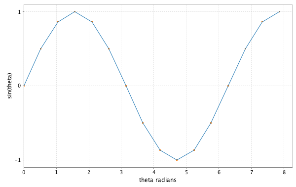
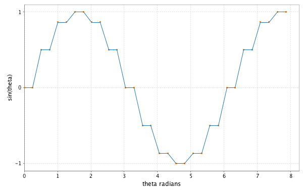
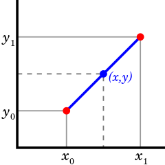

# Lazy List (`Stream`) Tutorial - Answers

## Part 0

In this tutorial, we will practice programming with lazy evaluation.  The tutorial culminates with a lazy implementation of Quicksort that exhibits the free benefits of lazy evaluation in efficiency and code elegance.

-----------

## Part 1: Interpolation

`code/tutorialAnswers/src/main/scala/tutorialAnswers/lecture5/Interpolation.scala`
`code/tutorialAnswers/src/main/scala/tutorialAnswers/lecture5/InterpolationExamples.scala`


In lecture we defined a sine wave like so:

```
  def sinePositive: Stream[Double] =
    Stream.cons(0,
      Stream.cons(1.0/2,
        Stream.cons(math.sqrt(3)/2,
          Stream.cons(1.0,
            Stream.cons(math.sqrt(3)/2,
              Stream.cons(1.0/2, sineNegative)
            )
          )
        )
      )
    )

  def sineNegative: Stream[Double] =
    sinePositive.map { d => -1*d }


  val sine = sinePositive
```

This is an example of ["tying the knot"](https://github.com/fpinscala/fpinscala/wiki/Chapter-5:-Strictness-and-laziness#tying-the-knot).


Plotting 16 elements from the `Stream`:

```
  val f = Figure()
  val p = f.subplot(0)
  val x = linspace(0.0,2.5*math.Pi, 16)

  val out: List[Double] = sine.toListFinite(16)

  p+= plot(x, out)
  p+= plot(x, out, '.')

  p.xlabel = "theta radians"
  p.ylabel = "sin(theta)"

  f.saveas("sine_wave.png")
```



We can use `flatMap` to insert new elements between existing elements:

```
  val stepperSine = sine.flatMap { d =>
    Stream.cons(d, Stream.cons(d, Stream.empty))
  }
```


```
  val stepperOut = stepperSine.toListFinite(32)

  val f = Figure()
  val p2 = f.subplot(0)
  val x2 = linspace(0.0,2.5*math.Pi, 32)

  p2 += plot(x2, stepperOut)
  p2 += plot(x2, stepperOut, '.')

  p2.xlabel = "theta radians"
  p2.ylabel = "sin(theta)"

  f.saveas("sine_wave_stepper.png")

```



### Task (1a): [Linear Interpolation](https://en.wikipedia.org/wiki/Linear_interpolation)

Use `flatMap` and two additional combinators found inside `common.lecture5.Stream` to implement linear interpolation on the given sine wave.  Add a single point between each of the given points -- the vertical midpoint.



Test your implementation with runnable class `tutorialAnswers.lecture5.InterpolationExample`.

In plotting the original sine wave, or the stepper sine wave, or this linear interpolated sine wave, we have not calculated any horizontal coordinates.  For instance, we could produce a `Stream[(Double, Double)]` where the first tuple member is `theta` and the second tuple member is `sine(theta)`.

Instead, we let Breeze provide the horizontal coordinates.

```
  val x3 = linspace(0.0,2.5*math.Pi, 32)
```

#### Answer


```
  val linearInterpolated =
    sine.zip(sine.tail).flatMap { case ((first: Double, second: Double)) =>
      val vMid = (first+second)/2.0
      Stream.cons(first, Stream.cons(vMid, Stream.empty))
    }
	
	
  import breeze.linalg._
  import breeze.plot._

  val linearInterpolatedOut = linearInterpolated.toListFinite(32)

  println(linearInterpolatedOut)

  val f = Figure()
  val p3 = f.subplot(0)
  val x3 = linspace(0.0,2.5*math.Pi, 32)

  p3 += plot(x3, linearInterpolatedOut)
  p3 += plot(x3, linearInterpolatedOut, '.')

  p3.xlabel = "theta radians"
  p3.ylabel = "sin(theta)"

  f.saveas("sine_wave_linear_interpolation.png")

  println("done plotting")

	
```

------------------

## Part 2: `scanRight` and Cumulative Moving Average

`code/tutorialAnswers/src/main/scala/tutorialAnswers/lecture5/ScanAverage.scala`


*FP in Scala*:

> "`scanRight` ... is like a foldRight that returns a stream of the intermediate results."

```
def scanRight[B](z: B)(f: (A, => B) => B): Stream[B]
```

```
def foldRight[B](z: => B)(f: (A, => B) => B): B

```

Run `ScanRightExample` for a scan that sums a Stream of incrementing Integers:

```
  val sum10 = Stream.from(0).take(6).scanRight(0)(_+_)

  sum10.print(10)
```


We will use `scanRight` to create a Stream of a cumulative moving average.

Previously, we have implemented [the formula here](https://en.wikipedia.org/wiki/Moving_average#Cumulative_moving_average).

[Algebird](https://github.com/twitter/algebird) provides an implementation of cumulative moving average in the `AveragedValue` and `AveragedGroup` classes.

### Task (2a): `average`

Use `scanRight`, `AveragedGroup.zero`, `AveragedGroup.plus` and the `AveragedValue` constructor to implement `average` for a `Stream[Int]` of incrementing Integers.

```
val incrementingNumbers: Stream[Int] = Stream.from(0)

val average: Stream[AveragedValue] =
    incrementingNumbers.take(32).???
```
Please note that a `take` must preceed a usage of `scanRight`.  `scanRight` doesn't behave well on infinite `Stream`s.

[AveragedValue Scaladoc](https://twitter.github.io/algebird/#com.twitter.algebird.AveragedValue)

[AveragedGroup Scaladoc](https://twitter.github.io/algebird/#com.twitter.algebird.AveragedGroup$)

Test your implementation with `AverageExample`.

#### Answer ()

```
  val incrementingNumbers: Stream[Int] = Stream.from(0)

  def f(i: Int, priorAverage: => AveragedValue) =
    AveragedGroup.plus(AveragedValue(1, i.toDouble), priorAverage)

  val average: Stream[AveragedValue] =
    incrementingNumbers.take(32).scanRight(AveragedGroup.zero)(f)
```

```
[info] Running slideCode.lecture5.AverageExample 
average of incrementing numbers
AveragedValue(32,15.5) AveragedValue(31,16.0) AveragedValue(30,16.5) AveragedValue(29,17.0)
AveragedValue(28,17.5) AveragedValue(27,18.0) AveragedValue(26,18.5) AveragedValue(25,19.0)
AveragedValue(24,19.5) AveragedValue(23,20.0) AveragedValue(22,20.5) AveragedValue(21,21.0)
AveragedValue(20,21.5) AveragedValue(19,22.0) AveragedValue(18,22.5) AveragedValue(17,23.0)
AveragedValue(16,23.5) AveragedValue(15,24.0) AveragedValue(14,24.5) AveragedValue(13,25.0)
AveragedValue(12,25.5) AveragedValue(11,26.0) AveragedValue(10,26.5) AveragedValue(9,27.0)
AveragedValue(8,27.5) AveragedValue(7,28.0) AveragedValue(6,28.5) AveragedValue(5,29.0)
AveragedValue(4,29.5) AveragedValue(3,30.0) AveragedValue(2,30.5) AveragedValue(1,31.0) 
```


---------------

## Part 3: Look-and-say and `unfold`

`code/tutorialAnswers/src/main/scala/tutorialAnswers/lecture5/LookandSay.scala`

We will implement the [Look-and-say Sequence](https://en.wikipedia.org/wiki/Look-and-say_sequence) in a `Stream`.

>In mathematics, the look-and-say sequence is the sequence of integers beginning as follows:

>1, 11, 21, 1211, 111221, 312211, 13112221, ...

>  To generate a member of the sequence from the previous member, read off the digits of the previous member, counting the number of digits in groups of the same digit. For example:

>  1 is read off as "one 1" or 11.

>  11 is read off as "two 1s" or 21.

>  21 is read off as "one 2, then one 1" or 1211.

>  1211 is read off as "one 1, then one 2, then two 1s" or 111221.

>  111221 is read off as "three 1s, then two 2s, then one 1" or 312211.


The challenge will not be to deduce the algorithm, but to fit a given algorithm into the `unfold` combinator.

Work from the [`using Stream` Scala code given here](https://www.rosettacode.org/wiki/Look-and-say_sequence#Scala):

```
object Main extends App {
 
  def lookAndSay(previous: List[BigInt]): Stream[List[BigInt]] = {
 
    def next(num: List[BigInt]): List[BigInt] = num match {
      case Nil => Nil
      case head :: Nil => 1 :: head :: Nil
      case head :: tail =>
        val size = (num takeWhile (_ == head)).size
        List(BigInt(size), head) ::: next(num.drop(size))
    }
    val x = next(previous)
    x #:: lookAndSay(x)
  }
 
  (lookAndSay(1 :: Nil) take 10).foreach(s => println(s.mkString("")))
}
```

### Task (3a): `lookAndSay`

Refactor the given code so that the sequence is generated using `unfold`:

```
def unfold[A, S](z: S)(f: S => Option[(A, S)]): Stream[A]
```

Implement `lookAndSay` using `unfold`
```
val lookAndSay: Stream[String] = Stream.unfold???
```

Use helper functions.

Test your implementation with `LookAndSayExample`.

#### Answer ()

```
  def next(num: List[BigInt]): List[BigInt] = num match {
    case Nil => Nil
    case head :: Nil => 1 :: head :: Nil
    case head :: tail =>
      val size = (num takeWhile (_ == head)).size
      List(BigInt(size), head) ::: next(num.drop(size))
  }

  def bigIntListToString(lbi: List[BigInt]): String =
    lbi.foldRight("")((bi: BigInt, s: String) => bi.toString + s)

  def f(priorList: List[BigInt]): Option[(String, List[BigInt])] = {
    val nextList: List[BigInt] = next(priorList)

    println("nextList = " + nextList)
    if (nextList.isEmpty) None
    else Some((bigIntListToString(priorList), nextList))
  }

  val initialLookAndSay = List(BigInt(1))

  val lookAndSay: Stream[String] = Stream.unfold(initialLookAndSay)(f)
```

```
[info] Running labAnswers.lecture5.LookAndSayExamples 
nextList = List(1, 1)
nextList = List(2, 1)
nextList = List(1, 2, 1, 1)
1
nextList = List(1, 1, 1, 2, 2, 1)
11
nextList = List(3, 1, 2, 2, 1, 1)
21
nextList = List(1, 3, 1, 1, 2, 2, 2, 1)
1211
nextList = List(1, 1, 1, 3, 2, 1, 3, 2, 1, 1)
111221
nextList = List(3, 1, 1, 3, 1, 2, 1, 1, 1, 3, 1, 2, 2, 1)
312211
nextList = List(1, 3, 2, 1, 1, 3, 1, 1, 1, 2, 3, 1, 1, 3, 1, 1, 2, 2, 1, 1)
13112221

```

---------------

## Part 4: Lazy QuickSort

`code/tutorialAnswers/src/main/scala/tutorialAnswers/lecture5/QuickSort.scala`

### (4a): Lazy QuickSort in Haskell

[Why is lazy evaluation useful?](http://stackoverflow.com/questions/265392/why-is-lazy-evaluation-useful)

[One great example is lazy Quicksort.](http://stackoverflow.com/a/284180/1007926)

In Haskell:

> 
```
	quickSort [] = []
	quickSort (x:xs) = quickSort (filter (< x) xs) ++ [x] ++ quickSort (filter (>= x) xs)
```

> If we now want to find the minimum of the list, we can define

> 
```
	minimum ls = head (quickSort ls)
```

> which first sorts the list and then takes the first element of the list. However, because of lazy evaluation, only the head gets computed. 

> For example, if we take the minimum of the list [2, 1, 3,] quickSort will first filter out all the elements that are smaller than two. Then it does quickSort on that (returning the singleton list [1]) which is already enough. Because of lazy evaluation, the rest is never sorted, saving a lot of computational time.

> This is of course a very simple example, but laziness works in the same way for programs that are very large.

> ...

> answered Nov 12 '08 at 14:51

> Chris Eidhof

Haskell Lists are lazy by default.

### (4b): Description and Evaluation

Quicksort implemented on a lazy List (Stream) will only do the work necessary to produce what is requested by the "evaluator."  The "evaluator" in this Stack Overflow example is function `head` in `head (quickSort ls)`.  In our example, we will see two evaluators: a printer function, and the `headOption` function.

```
  // recursive function
  def quickSort(si: Stream[Int]): Stream[Int] = {
	???
  }
  

  def listToStream[A](la: List[A]): Stream[A] =
    unfold(la){(listA: List[A]) => listA match {
      case h::t => Some((h, t))
      case Nil => None
    }
    }
  

  def quickSort(li: List[Int]): common.lecture5.Stream[Int] =
    quickSort(listToStream(li))
	

  ...
  
  val sortedLazy = quickSort(unsorted)
  
  sortedLazy.print(8)

  val sortedLazy2 = quickSort(unsorted)

  println(sortedLazy2.headOption)
	
```


### Task (4c): implement `quickSort`

```
  def quickSort(si: Stream[Int]): Stream[Int] = {
    println("call")
	...
  }
```

Base your implementation off of the Haskell code above, or [this example](http://stackoverflow.com/a/2692084/1007926).  Note we have not implemented `partition` on our `Stream`.

Test your implementation by running class `QuickSortExample`.  

`QuickSortExample` will produce:

* an unordered random List of integers
* the least 4 digits in sorted order
* the least 8 digits in sorted order
* the least 4 digits in sorted order, again, to demonstrate memoization
* the least 6 digits in sorted order
* finally, the head of `quickSort`'s output `Stream`; the least element

These will be explained in the next section.

#### Answer ()

```
  def quickSort(si: Stream[Int]): Stream[Int] = {
    println("call")
    si match {
      case common.lecture5.Empty => empty
      case common.lecture5.Stream.cons(head, tail) =>
        quickSort(tail.filter(_ < head)).
          append(unit(head)).
          append(quickSort(tail.filter(_ >= head)))
    }
  }
```


```

[info] Running tutorialAnswers.lecture5.QuickSortExample 
unsorted
List(49, 17, 14, 11, 14, 55, 40, 41, 18, 17, 19, 11, 43, 20, 33, 33)
---------
call
call
call
call
call
sort 4 digits
11 call
call
11 call
14 call
call
14 

-----------------------
call
call
call
call
call
sort 8 digits
11 call
call
11 call
14 call
call
14 call
17 call
call
call
call
17 call
18 call
call
19 

-----------------------
call
call
call
call
call
least element / head
Some(11)
---------------------------
re-use of `sortedLazy`; demonstration of memoization
sort 4 digits
11 11 14 14 
sort 6 digits
11 11 14 14 call
17 call
call
call
call
17 
[success] Total time: 7 s, completed Jun 26, 2016 9:09:59 PM
```


### (4d): Checking laziness

The following examples are implemented in `QuickSortExample`.  They rely on your completion of the <b>Task (4c)</b>.

Check that your implementation produces similar results.

We will test that our implementation of `quickSort` is lazy by adding print statement `println("call")`:


```

  // recursive function
  def quickSort(si: Stream[Int]): Stream[Int] = {
    println("call")
	???
  }

```


Given an unsorted `List`:

```
[info] Running tutorialAnswers.lecture5.QuickSortExample 
unsorted
List(41, 7, 13, 58, 4, 31, 61, 10, 51, 1, 27, 20, 50, 55, 32, 50)

```

First produce the least 4 digits, sorted:

```
  val sortedLazy = quickSort(unsorted)
  println("sort 4 digits")
  sortedLazy.print(4)

  println()

```

Output: 

```
call
call
call
call
call
sort 4 digits
1 call
4 call
7 call
call
call
10 

```

Then produce the least 8 digits, sorted:

```
  val sortedLazy2 = quickSort(unsorted)
  println("sort 8 digits")
  sortedLazy2.print(8)

  println()

```

Output: 

```
call
call
call
call
call
sort 8 digits
1 call
4 call
7 call
call
call
10 call
13 call
call
call
call
20 call
27 call
31 

```

Then produce the head of the List; the least element:

```
  val sortedLazy3 = quickSort(unsorted)
  println("least element / head")
  println(sortedLazy3.headOption)
```

Output:

```
call
call
call
call
call
least element / head
Some(1)
```

Note what happens when we re-use a Stream that has already been "evaluated":

```
  val sortedLazy = quickSort(unsorted)
  println("sort 4 digits")
  sortedLazy.print(4)

  println()


  println("---------------------------")

  println("re-use of `sortedLazy`; demonstration of memoization")

  println("sort 4 digits")
  sortedLazy.print(4)

  println("sort 6 digits")
  sortedLazy.print(6)

```


```

[info] Running tutorialAnswers.lecture5.QuickSortExample 
unsorted
List(49, 17, 14, 11, 14, 55, 40, 41, 18, 17, 19, 11, 43, 20, 33, 33)
---------
call
call
call
call
call
sort 4 digits
11 call
call
11 call
14 call
call
14 

---------------------------
re-use of `sortedLazy`; demonstration of memoization
sort 4 digits
11 11 14 14 
sort 6 digits
11 11 14 14 call
17 call
call
call
call
17 
[success] Total time: 7 s, completed Jun 26, 2016 9:09:59 PM

```

The evidence of work done (`println("call")`) has disappeared in the second printing of the least four digits:

```
sort 4 digits
11 11 14 14 
```


------------------
## Resources

[Why is lazy evaluation useful?](http://stackoverflow.com/questions/265392/why-is-lazy-evaluation-useful)

[Why is lazy evaluation useful?  Lazy Quicksort](http://stackoverflow.com/a/284180/1007926)

[lazy QuickSort in Scala](http://stackoverflow.com/questions/2690989/lazy-quicksort-in-scala)

[Why is the minimalist, example Haskell quicksort not a “true” quicksort?](http://stackoverflow.com/questions/7717691/why-is-the-minimalist-example-haskell-quicksort-not-a-true-quicksort)

[QuickSort in Haskell](https://wiki.haskell.org/Introduction#Quicksort_in_Haskell)
